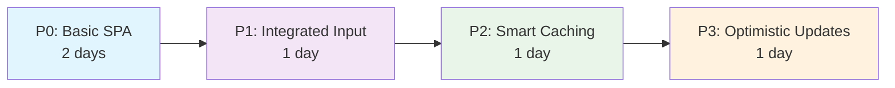
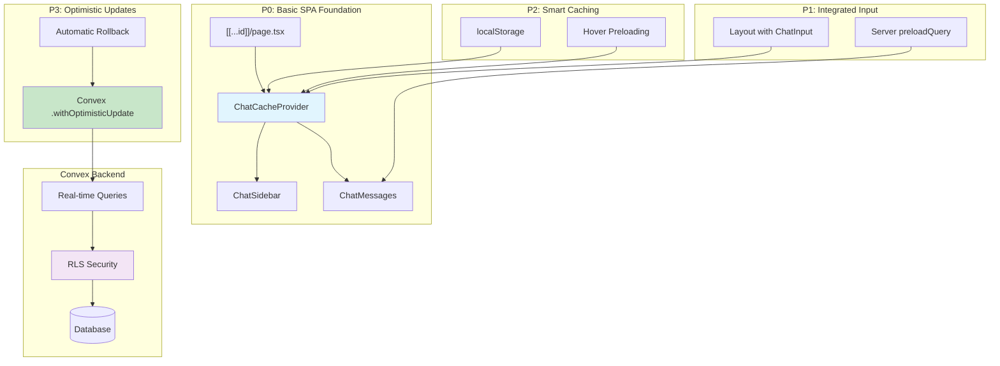
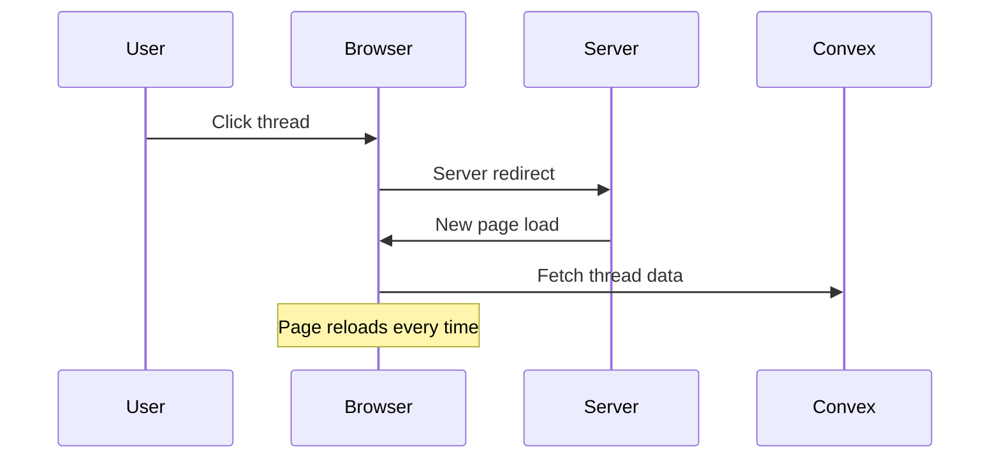
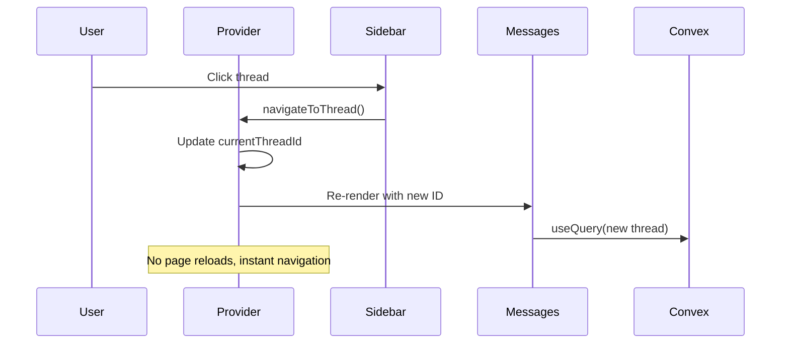

# Key Decisions Summary

## Your Main Concerns Addressed

### 1. **superjson Serialization** ✅ Keep It

**Your concern**: "superjson serialization is needed I think because date type cannot be stored in convex db"

**Decision**: **Keep superjson for now**

- ✅ It's working well for your Date types
- ✅ No breaking changes needed
- ✅ Can migrate later if needed
- ✅ Focus on SPA architecture first

### 2. **UUID vs Convex ID** ✅ Stick with UUID

**Your concern**: "I want to move away from generating uuid from client side and rather use the convex id from server"

**Analysis**:

- **UUID approach** (current): Simpler, URL updates immediately, works well with optimistic updates
- **Convex ID approach**: More "correct" but adds workflow complexity

**Decision**: **Keep UUID approach**

- ✅ Less complexity for Phase 0
- ✅ URL updates immediately
- ✅ Easier optimistic updates
- ✅ Can revisit later if needed

### 3. **Convex Built-in Optimistic Updates** ✅ Use Them

**Your insight**: "convex have some built-in optimistic update features, but I guess we can use it here?"

**Decision**: **YES! Use Convex built-in optimistic updates**

```typescript
// Much simpler than custom implementation
const createMessage = useMutation(api.chat.createChat).withOptimisticUpdate(
  (localStore, args) => {
    // Convex handles all the complexity
    const threads = localStore.getQuery(api.chat.getUserThreads, {});
    if (threads) {
      localStore.setQuery(api.chat.getUserThreads, {}, [
        ...threads.results,
        { ...args, _id: crypto.randomUUID(), isOptimistic: true },
      ]);
    }
  }
);
```

**Benefits**:

- ✅ Automatic rollback on errors
- ✅ No custom state management needed
- ✅ Built-in error handling
- ✅ Much less code

### 4. **Complexity Management** ✅ Evolutionary Approach

**Your concern**: "I'm scared we are doing many too many sub changes that might conflict"

**Solution**: **Clear evolutionary phases with minimal changes**

#### Phase Progression



**Each phase is**:

- ✅ **Testable independently**
- ✅ **Rollback-safe** (can stop at any phase)
- ✅ **Minimal changes** (3-5 files per phase)
- ✅ **Clear benefits** (immediate UX improvements)

## Complete Architecture Overview



## Data Flow Clarity

### Current State (Confusing)



### After P0 (Clear)



## Implementation Risk Assessment

### P0 Risk: **LOW** 🟢

- **Changes**: 4-5 files
- **Rollback**: Easy (git revert)
- **Breaking**: Minimal (same API routes)
- **Testing**: Each piece works independently

### P1 Risk: **LOW** 🟢

- **Changes**: Layout + preloading
- **Rollback**: Easy (remove preloading)
- **Breaking**: None (additive only)

### P2 Risk: **MEDIUM** 🟡

- **Changes**: localStorage logic
- **Rollback**: Easy (disable localStorage)
- **Breaking**: None (localStorage is optional)

### P3 Risk: **MEDIUM** 🟡

- **Changes**: Add optimistic updates
- **Rollback**: Easy (remove .withOptimisticUpdate)
- **Breaking**: None (server unchanged)

## Success Metrics

### P0 Success Criteria

- [ ] No server redirects (check Network tab)
- [ ] Thread navigation under 100ms
- [ ] Sidebar shows real data
- [ ] URL updates correctly

### P1 Success Criteria

- [ ] Input immediately interactive
- [ ] Faster initial page load
- [ ] Seamless server-to-client flow

### P2 Success Criteria

- [ ] Thread switching under 50ms
- [ ] Recent threads persist on refresh
- [ ] Hover preloading works

### P3 Success Criteria

- [ ] Messages appear instantly
- [ ] Automatic error rollback
- [ ] Professional chat UX

## Next Steps

1. **Start with P0** (2 days)

   - Follow the detailed guide in `08-p0-implementation-guide.md`
   - Test thoroughly before moving to P1

2. **Validate each phase**

   - Use the success criteria above
   - Don't rush to the next phase

3. **Stop at any phase if needed**
   - Each phase provides real value
   - P0 alone makes your app much better

You have a **clear, low-risk path** from your current working app to a professional SPA experience. The evolutionary approach means you can stop at any point with a better app than you started with!

Ready to start P0? 🚀
