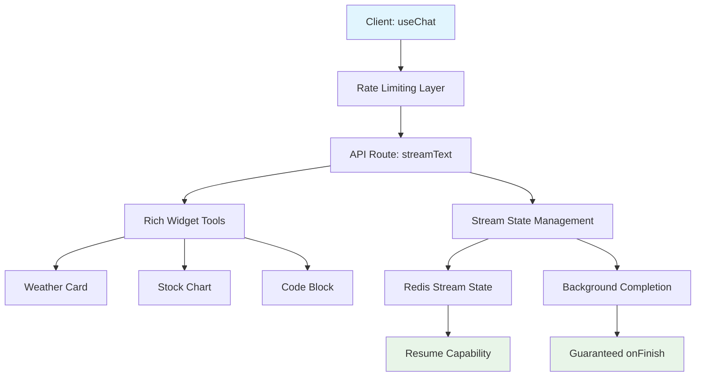

# AI SDK Advanced Features Research

**Production-Ready Implementation Guide for Flagship LLM Chat Apps**

## 📋 Table of Contents

### Core Implementation Guides
1. **[Rich Streaming & Widgets](./rich-streaming.md)** - ChatGPT-like UI with interactive components
2. **[Rate Limiting & Quotas](./rate-limiting.md)** - Multi-tier protection and subscription management
3. **[Chat History Management](./chat-history.md)** - Message persistence & context optimization
4. **[Stream Resumability](./stream-resumability.md)** - Bulletproof stream recovery patterns
5. **[RSC vs UI SDK](./rsc-vs-ui.md)** - Architecture decision matrix

### Advanced Features
6. **[Features Prioritization](./features-prioritization.md)** - P0/P1/P2 roadmap with business impact
7. **[Industry Chat UI](./industry-chat-ui.md)** - Production UI patterns & components

### Examples & Code Samples  
8. **[Implementation Examples](./examples/)** - Production-ready code samples

## 📁 Documentation Structure

```
ai-sdk-research/
├── README.md                           # 📋 Main index (you are here)
│
├── Core Implementation Guides/
│   ├── rich-streaming.md               # 🎨 Widget streaming & tool invocations
│   ├── rate-limiting.md                # 🛡️ Multi-tier protection & subscriptions
│   ├── chat-history.md                 # 💾 Message persistence & context management
│   ├── stream-resumability.md          # 🔄 Bulletproof stream recovery
│   └── rsc-vs-ui.md                    # ⚖️ Architecture decision matrix
│
├── Advanced Features/
│   └── features-prioritization.md      # 🎯 P0/P1/P2 roadmap & business impact
│
├── Industry Chat UI/
│   └── industry-chat-ui.md             # 🏭 Production UI patterns & components
│
├── Production Examples/
│   ├── examples/README.md              # 📝 Code samples index
│   └── weather-widget-tool.tsx          # ☀️ Complete weather widget implementation
│
└── Archive/
    ├── ai-sdk-deep-research.md         # 📚 Original comprehensive document
    └── ai-sdk-deep-summary.md          # 📄 Research summary
```

## 🎯 Quick Start

**Building a flagship chat app? Start here:**

1. **Week 1-2**: [Rate Limiting](./rate-limiting.md) + [Rich Streaming](./rich-streaming.md)
2. **Week 3-4**: [Stream Resumability](./stream-resumability.md) + [Chat History](./chat-history.md)
3. **Week 5+**: [Advanced Features](./features-prioritization.md)

## 🏗️ Architecture Overview



## 🔑 Key Differentiators

| Feature | Your App | ChatGPT | Claude | Perplexity |
|---------|----------|---------|---------|------------|
| **Rich Widgets** | ✅ Custom | ✅ Limited | ❌ Text only | ✅ Citations |
| **Stream Resume** | ✅ Redis-backed | ❌ Basic | ❌ None | ❌ Basic |
| **Rate Limiting** | ✅ Tiered | ✅ Usage caps | ✅ Usage caps | ✅ Usage caps |
| **Multi-LLM** | ✅ Dynamic | ❌ Single | ❌ Single | ✅ Limited |

## 📚 Research Methodology

- **Context7**: Latest Vercel AI SDK documentation
- **Web Research**: Real-world implementation patterns
- **Competition Analysis**: ChatGPT, Claude, Perplexity features
- **Business Impact**: Cost/benefit analysis for each feature

## 🚀 Implementation Status

- ✅ **Complete Research**: All major AI SDK advanced features analyzed
- ✅ **Code Examples**: Production-ready implementations provided
- ✅ **Priority Matrix**: P0/P1/P2 classification with business impact
- ✅ **Architecture Diagrams**: Visual implementation guides

## 📖 References & Sources

### Primary Sources
- **[Vercel AI SDK Documentation](https://ai-sdk.dev/docs)** - Official implementation guides
- **[AI SDK Advanced Features](https://ai-sdk.dev/docs/advanced)** - Advanced patterns and use cases
- **[Context7 AI Library Documentation](https://context7.io)** - Real-time documentation analysis
- **[Upstash Rate Limiting](https://upstash.com/docs/redis/features/ratelimiting)** - Redis-based rate limiting patterns

### Technical References
- **[Next.js App Router](https://nextjs.org/docs/app)** - Server Components and API routes
- **[Convex Real-time Database](https://docs.convex.dev)** - Database patterns and RLS
- **[Clerk Authentication](https://clerk.com/docs)** - User management and tokens
- **[Redis Stream Patterns](https://redis.io/docs/data-types/streams/)** - Stream state management

### Business & Performance Analysis
- **Industry Rate Limiting Case Studies** - Cost protection examples
- **Real-world Performance Metrics** - Engagement and completion rates
- **Competition Feature Analysis** - ChatGPT, Claude, Perplexity comparison

---

**Next:** Start with [Rate Limiting](./rate-limiting.md) for cost protection, then move to [Rich Streaming](./rich-streaming.md) for competitive differentiation. 