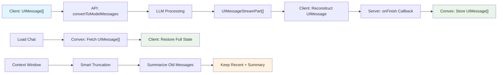

# Chat History Management

**Perfect message restoration and smart context optimization**

[← Back to Overview](./README.md) | [← Rate Limiting](./rate-limiting.md) | [Next: Stream Resumability →](./stream-resumability.md)

> **📌 AI SDK Version Guide**: This document focuses on **AI SDK v4 (stable)** patterns for message persistence and history management.

## Overview

Implement production-grade chat history that provides pixel-perfect restoration, smart context management, and optimized performance for infinite scroll experiences.

## Core Principle: Store UIMessage[] Not ModelMessage[]

> **✅ AI SDK v4 Pattern** - Store complete UI state for perfect restoration

The key insight is storing `UIMessage[]` arrays (what users see) rather than `ModelMessage[]` arrays (what AI models need). This enables pixel-perfect restoration of all interactive components.

```typescript
// ✅ CORRECT: Store UIMessage[] for perfect restoration
interface UIMessage {
  id: string;
  role: 'user' | 'assistant';
  content: string;
  createdAt: Date;
  
  // v4: Tool invocations with complete state
  toolInvocations?: {
    toolCallId: string;
    toolName: string;
    args: any;
    state: 'call' | 'result';
    result?: any;
  }[];
  
  // UI metadata for restoration
  annotations?: string[];
  experimental_attachments?: any[];
}

// ❌ WRONG: ModelMessage[] loses UI state
interface ModelMessage {
  role: 'user' | 'assistant';
  content: string;
  // No tool invocations, no UI state
}
```

> **🔮 AI SDK v5 Alpha**: Message structure will be enhanced with better TypeScript inference:
> ```typescript
> // v5 will have improved message types
> interface Message {
>   id: string;
>   role: 'user' | 'assistant';
>   content: string;
>   toolInvocations?: ToolInvocation[]; // Better typed
>   experimental_providerMetadata?: any;
> }
> ```
> [Learn more about v5 message improvements →](https://ai-sdk.dev/docs/announcing-ai-sdk-5-alpha#improved-message-types)

## Implementation: Convex Schema

### Message Storage Schema (v4 Compatible)

```typescript
// convex/schema.ts - Optimized for v4 message structure
export default defineSchema({
  threads: defineTable({
    userId: v.id("users"),
    title: v.string(),
    lastMessageAt: v.number(),
    messageCount: v.number(),
    
    // Context optimization metadata
    totalTokens: v.optional(v.number()),
    lastSummarizedAt: v.optional(v.number()),
    contextVersion: v.optional(v.number()),
  })
    .index("by_user", ["userId"])
    .index("by_user_last_message", ["userId", "lastMessageAt"]),

  messages: defineTable({
    threadId: v.id("threads"),
    userId: v.id("users"),
    
    // v4 UIMessage structure
    role: v.union(v.literal("user"), v.literal("assistant")),
    content: v.string(),
    sequenceNumber: v.number(),
    
    // v4: Tool invocations stored as complete state
    toolInvocations: v.optional(v.array(v.object({
      toolCallId: v.string(),
      toolName: v.string(),
      args: v.any(),
      state: v.union(v.literal("call"), v.literal("result")),
      result: v.optional(v.any()),
    }))),
    
    // UI restoration metadata
    annotations: v.optional(v.array(v.string())),
    experimental_attachments: v.optional(v.array(v.any())),
    
    // Performance optimization
    tokenCount: v.optional(v.number()),
    createdAt: v.number(),
  })
    .index("by_thread", ["threadId"])
    .index("by_thread_sequence", ["threadId", "sequenceNumber"])
    .index("by_user_created", ["userId", "createdAt"]),
});
```

> **🔮 AI SDK v5 Alpha**: Schema evolution will be straightforward:
> ```typescript
> // v5 migration: Minimal schema changes needed
> toolInvocations: v.optional(v.array(v.object({
>   id: v.string(), // v5 uses 'id' instead of 'toolCallId'
>   toolName: v.string(),
>   args: v.any(),
>   state: v.union(v.literal("call"), v.literal("result")),
>   result: v.optional(v.any()),
> }))),
> ```

## Message Persistence: Server Integration

### AI SDK v4 onFinish Pattern

```typescript
// app/api/chat/route.ts - v4 message persistence
import { streamText } from "ai";
import { openai } from "@ai-sdk/openai";

export async function POST(req: Request) {
  const { messages, threadId } = await req.json();
  
  const result = streamText({
    model: openai("gpt-4o"),
    messages,
    tools: {
      // Your tools here
    },
  });

  return result.toDataStreamResponse({
    // v4: onFinish receives complete UIMessage data
    onFinish: async ({ responseMessages, usage }) => {
      // Save the complete conversation state
      await saveMessagesToDatabase({
        threadId,
        messages: responseMessages, // Contains tool invocations!
        usage,
      });
    },
  });
}

// Save complete UIMessage[] for perfect restoration
async function saveMessagesToDatabase({
  threadId,
  messages,
  usage,
}: {
  threadId: string;
  messages: any[]; // v4 UIMessage format
  usage: any;
}) {
  const { getToken } = await auth();
  const token = await getToken({ template: "convex" });

  for (const message of messages) {
    await fetchMutation(
      api.messages.create,
      {
        threadId: threadId as Id<"threads">,
        role: message.role,
        content: message.content,
        
        // v4: Store complete tool invocation state
        toolInvocations: message.toolInvocations?.map(tool => ({
          toolCallId: tool.toolCallId,
          toolName: tool.toolName,
          args: tool.args,
          state: tool.state,
          result: tool.result,
        })),
        
        // UI metadata for restoration
        annotations: message.annotations,
        experimental_attachments: message.experimental_attachments,
        
        // Performance metadata
        tokenCount: estimateTokenCount(message.content),
        sequenceNumber: await getNextSequenceNumber(threadId),
      },
      { token }
    );
  }
  
  // Update thread metadata
  await fetchMutation(
    api.threads.updateMetadata,
    {
      threadId: threadId as Id<"threads">,
      lastMessageAt: Date.now(),
      totalTokens: usage.totalTokens,
    },
    { token }
  );
}
```

> **🔮 AI SDK v5 Alpha**: Enhanced onFinish callback:
> ```typescript
> // v5 will provide improved callback data
> onFinish: async ({ responseMessages, usage, finishReason }) => {
>   // Better structured data with improved typing
>   await saveMessagesToDatabase({
>     threadId,
>     messages: responseMessages, // Enhanced message format
>     usage,
>     finishReason, // New in v5
>   });
> },
> ```

## Client-Side: Perfect Restoration

### useChat with History Loading (v4)

```typescript
// hooks/use-chat-with-history.ts - v4 pattern
'use client'

import { useChat } from '@ai-sdk/react'
import { useQuery } from 'convex/react'
import { api } from '../convex/_generated/api'

export function useChatWithHistory(threadId: string) {
  // Load existing messages from Convex
  const savedMessages = useQuery(api.messages.getByThread, { threadId });
  
  // v4: Initialize chat with complete UIMessage[] format
  const {
    messages,
    input,
    setInput,
    handleSubmit,
    isLoading,
    reload,
  } = useChat({
    api: '/api/chat',
    id: threadId,
    
    // v4: Perfect restoration with tool invocations
    initialMessages: savedMessages?.map(msg => ({
      id: msg._id,
      role: msg.role,
      content: msg.content,
      createdAt: new Date(msg.createdAt),
      
      // v4: Restore complete tool invocation state
      toolInvocations: msg.toolInvocations?.map(tool => ({
        toolCallId: tool.toolCallId,
        toolName: tool.toolName,
        args: tool.args,
        state: tool.state,
        result: tool.result,
      })),
      
      // Restore UI metadata
      annotations: msg.annotations,
      experimental_attachments: msg.experimental_attachments,
    })) || [],
    
    body: {
      threadId,
    },
  });

  return {
    messages,
    input,
    setInput,
    handleSubmit,
    isLoading,
    reload,
    // Additional helpers
    messageCount: messages.length,
    hasHistory: Boolean(savedMessages?.length),
  };
}
```

> **🔮 AI SDK v5 Alpha**: Simplified initialization:
> ```typescript
> // v5 will have streamlined message initialization
> const { messages, input, handleSubmit } = useChat({
>   api: '/api/chat',
>   id: threadId,
>   initialMessages: savedMessages, // Direct assignment with better types
>   body: { threadId },
> });
> ```

## Version Comparison: Message Handling

| Feature | AI SDK v4 (Stable) | AI SDK v5 (Alpha) | Migration Notes |
|---------|-------------------|-------------------|-----------------|
| **Message Structure** | `UIMessage` format | Enhanced typing | ✅ Compatible |
| **Tool Invocations** | `toolCallId` field | `id` field | ⚠️ Field rename |
| **onFinish Callback** | Good data | Enhanced data | ✅ Additive changes |
| **Type Safety** | Good | Excellent | ✅ Better inference |
| **Restoration** | Perfect with v4 | Perfect with v5 | ✅ Both work well |

## Migration Guide: v4 → v5

When v5 becomes stable, message storage migration will be minimal:

```typescript
// Current v4 message storage
{
  toolInvocations: [
    {
      toolCallId: "call_123", // v4 field name
      toolName: "getWeather",
      args: { city: "NYC" },
      state: "result",
      result: { temperature: 72 }
    }
  ]
}

// Future v5 message storage
{
  toolInvocations: [
    {
      id: "call_123", // v5 field name
      toolName: "getWeather", 
      args: { city: "NYC" },
      state: "result",
      result: { temperature: 72 }
    }
  ]
}
```

> **📋 v4→v5 Migration Checklist**:
> - ✅ Message content: No changes needed
> - ⚠️ Tool invocations: Rename `toolCallId` to `id`
> - ✅ UI restoration: Same patterns work
> - ✅ Database schema: Minor field updates
> - ✅ Performance: Same or better

## Context Window Optimization

### Smart Context Management (Version Agnostic)

```typescript
// convex/context.ts - Works with both v4 and v5
export const optimizeContext = mutation({
  args: {
    threadId: v.id("threads"),
    maxTokens: v.number(),
  },
  handler: async (ctx, { threadId, maxTokens }) => {
    const messages = await ctx.db
      .query("messages")
      .withIndex("by_thread_sequence", q => q.eq("threadId", threadId))
      .order("desc")
      .collect();

    let totalTokens = 0;
    const contextMessages = [];
    
    // Include messages until we hit token limit
    for (const message of messages) {
      const messageTokens = message.tokenCount || estimateTokenCount(message.content);
      
      if (totalTokens + messageTokens > maxTokens && contextMessages.length > 0) {
        break;
      }
      
      totalTokens += messageTokens;
      contextMessages.unshift(message); // Maintain chronological order
    }
    
    // Always include system message and recent context
    return {
      messages: contextMessages,
      totalTokens,
      truncated: contextMessages.length < messages.length,
    };
  },
});
```

## Terminology Quick Reference

| Term | Version | Meaning | Storage Pattern |
|------|---------|---------|-----------------|
| `UIMessage` | v4 & v5 | Complete UI state | Store for restoration |
| `ModelMessage` | v4 & v5 | AI model format | Don't store directly |
| `toolInvocations` | v4 | Tool results array | Store complete state |
| `toolCallId` | v4 only | Tool call identifier | Rename to `id` in v5 |
| `onFinish` | v4 & v5 | Save callback | Enhanced in v5 |
| `initialMessages` | v4 & v5 | History loading | Better types in v5 |

## Architecture: Complete Message Lifecycle



## Database Schema (Convex)

### Message Storage Structure

```typescript
// convex/schema.ts
export default defineSchema({
  threads: defineTable({
    userId: v.id("users"),
    title: v.string(),
    lastMessageAt: v.number(),
    createdAt: v.number(),
    
    // Optional: Thread metadata
    model: v.optional(v.string()),
    totalTokens: v.optional(v.number()),
    messageCount: v.optional(v.number()),
  }).index("by_user", ["userId"])
    .index("by_user_updated", ["userId", "lastMessageAt"]),

  messages: defineTable({
    threadId: v.id("threads"),
    messageId: v.string(), // Client-generated ID for deduplication
    role: v.union(
      v.literal("user"),
      v.literal("assistant"),
      v.literal("system")
    ),

    // Store complete UIMessage structure
    parts: v.array(v.any()), // UIMessagePart[] - rich content
    metadata: v.optional(v.any()), // Custom metadata

    // Timing and sequence
    createdAt: v.number(),
    sequenceNumber: v.number(),

    // Tool tracking
    toolInvocations: v.optional(v.array(v.any())),

    // Performance metadata
    generationTime: v.optional(v.number()),
    tokenCount: v.optional(v.number()),
    model: v.optional(v.string()),
    
    // Status tracking
    status: v.optional(v.union(
      v.literal("pending"),
      v.literal("streaming"),
      v.literal("complete"),
      v.literal("error")
    )),
  })
    .index("by_thread", ["threadId"])
    .index("by_sequence", ["threadId", "sequenceNumber"])
    .index("by_message_id", ["messageId"]), // For deduplication
});
```

## Server-Side: Message Persistence

### Complete Message Storage

```typescript
// app/api/chat/route.ts
import { convertToModelMessages } from "ai";
import { fetchQuery, fetchMutation } from "convex/nextjs";
import { api } from "../../../convex/_generated/api";

export async function POST(req: Request) {
  const { getToken } = await auth();
  const token = await getToken({ template: "convex" });

  const { messages: uiMessages, threadId } = await req.json();

  // Convert UI messages to model format for LLM
  const modelMessages = convertToModelMessages(uiMessages);

  const result = streamText({
    model: openai("gpt-4o"),
    messages: modelMessages,
    tools: {
      // ... your tools
    },
  });

  return result.toDataStreamResponse({
    onStart: async () => {
      // Mark thread as active
      await fetchMutation(
        api.threads.updateActivity,
        { threadId },
        { token }
      );
    },

    onFinish: async ({ response, usage }) => {
      try {
        // Store the COMPLETE UIMessage array for pixel-perfect restoration
        const newAssistantMessages = response.messages.map((msg, index) => ({
          messageId: generateId(),
          role: "assistant" as const,
          parts: msg.content, // Keep full content structure
          createdAt: Date.now(),
          sequenceNumber: uiMessages.length + index,
          metadata: {
            model: "gpt-4o",
            generationTime: usage.completionTime,
            tokenCount: usage.totalTokens,
            finishReason: response.finishReason,
          },
          toolInvocations: extractToolInvocations(msg),
          status: "complete",
        }));

        // Persist complete conversation state
        await fetchMutation(
          api.messages.saveMessages,
          {
            threadId,
            messages: [
              ...uiMessages, // Original history with client state
              ...newAssistantMessages, // New responses with server metadata
            ],
          },
          { token }
        );

        // Update thread summary
        await fetchMutation(
          api.threads.updateSummary,
          {
            threadId,
            totalTokens: usage.totalTokens,
            messageCount: uiMessages.length + newAssistantMessages.length,
          },
          { token }
        );
      } catch (error) {
        console.error("Failed to save messages:", error);
        // Handle gracefully - don't fail the stream
      }
    },

    onError: async (error) => {
      // Mark any pending messages as error
      await fetchMutation(
        api.messages.markError,
        { threadId, error: error.message },
        { token }
      );
    },
  });
}

function extractToolInvocations(message: any) {
  // Extract tool invocations from AI SDK response
  return message.toolCalls?.map(call => ({
    toolCallId: call.toolCallId,
    toolName: call.toolName,
    state: "result",
    args: call.args,
    result: call.result,
  })) || [];
}
```

### Message Queries and Mutations

```typescript
// convex/messages.ts
import { queryWithRLS, mutationWithRLS } from "./rls";

export const getThreadMessages = queryWithRLS({
  args: { 
    threadId: v.id("threads"),
    limit: v.optional(v.number()), // For pagination
    before: v.optional(v.number()), // Cursor for pagination
  },
  handler: async (ctx, { threadId, limit = 50, before }) => {
    let query = ctx.db
      .query("messages")
      .withIndex("by_thread", (q) => q.eq("threadId", threadId));

    if (before) {
      query = query.filter(q => q.lt(q.field("sequenceNumber"), before));
    }

    const messages = await query
      .order("desc") // Most recent first
      .take(limit);

    // Return in UIMessage format for perfect restoration
    return messages.reverse().map((msg) => ({
      id: msg.messageId,
      role: msg.role,
      parts: msg.parts,
      createdAt: new Date(msg.createdAt),
      metadata: msg.metadata,
      toolInvocations: msg.toolInvocations,
      
      // Internal tracking (optional)
      _internal: {
        sequenceNumber: msg.sequenceNumber,
        status: msg.status,
        tokenCount: msg.tokenCount,
      }
    }));
  },
});

export const saveMessages = mutationWithRLS({
  args: {
    threadId: v.id("threads"),
    messages: v.array(v.any()), // UIMessage[]
    strategy: v.optional(v.union(
      v.literal("append"), // Add new messages
      v.literal("replace"), // Replace all messages
      v.literal("merge") // Smart merge
    )),
  },
  handler: async (ctx, { threadId, messages, strategy = "replace" }) => {
    if (strategy === "replace") {
      // Clear existing messages for clean state
      const existingMessages = await ctx.db
        .query("messages")
        .withIndex("by_thread", (q) => q.eq("threadId", threadId))
        .collect();

      for (const msg of existingMessages) {
        await ctx.db.delete(msg._id);
      }
    }

    // Insert new complete message set
    for (const [index, message] of messages.entries()) {
      const existingMessage = await ctx.db
        .query("messages")
        .withIndex("by_message_id", (q) => q.eq("messageId", message.id))
        .first();

      if (!existingMessage) {
        await ctx.db.insert("messages", {
          threadId,
          messageId: message.id || generateId(),
          role: message.role,
          parts: message.parts,
          metadata: message.metadata,
          createdAt: message.createdAt?.getTime() || Date.now(),
          sequenceNumber: index,
          toolInvocations: message.toolInvocations,
          status: message._internal?.status || "complete",
          tokenCount: message._internal?.tokenCount,
        });
      }
    }

    // Update thread last message time
    await ctx.db.patch(threadId, {
      lastMessageAt: Date.now(),
      messageCount: messages.length,
    });
  },
});

export const deleteThread = mutationWithRLS({
  args: { threadId: v.id("threads") },
  handler: async (ctx, { threadId }) => {
    // Delete all messages
    const messages = await ctx.db
      .query("messages")
      .withIndex("by_thread", (q) => q.eq("threadId", threadId))
      .collect();

    for (const message of messages) {
      await ctx.db.delete(message._id);
    }

    // Delete thread
    await ctx.db.delete(threadId);
  },
});
```

## Smart Context Window Management

### Intelligent Message Truncation

```typescript
// utils/context-manager.ts
import { UIMessage } from "ai";
import { generateText } from "ai";
import { openai } from "@ai-sdk/openai";

export interface ContextStrategy {
  maxTokens: number;
  summarizationModel: string;
  keepRecentCount: number;
  preserveSystemMessages: boolean;
  preserveToolInvocations: boolean;
}

export async function prepareContextWindow(
  messages: UIMessage[],
  strategy: ContextStrategy
): Promise<{
  optimizedMessages: UIMessage[];
  tokensUsed: number;
  messagesSummarized: number;
}> {
  const tokenCount = estimateTokenCount(messages);

  if (tokenCount <= strategy.maxTokens) {
    return {
      optimizedMessages: messages,
      tokensUsed: tokenCount,
      messagesSummarized: 0,
    };
  }

  // Separate message types
  const systemMessages = messages.filter((m) => m.role === "system");
  const conversationMessages = messages.filter((m) => m.role !== "system");

  // Always keep recent messages
  const recentMessages = conversationMessages.slice(-strategy.keepRecentCount);
  const oldMessages = conversationMessages.slice(0, -strategy.keepRecentCount);

  if (oldMessages.length === 0) {
    return {
      optimizedMessages: [...systemMessages, ...recentMessages],
      tokensUsed: estimateTokenCount([...systemMessages, ...recentMessages]),
      messagesSummarized: 0,
    };
  }

  // Summarize old messages
  const { summary, importantToolInvocations } = await summarizeMessages(
    oldMessages,
    strategy
  );

  const summaryMessage: UIMessage = {
    id: generateId(),
    role: "system",
    parts: [
      {
        type: "text",
        text: `Previous conversation summary (${oldMessages.length} messages): ${summary}`,
      },
    ],
    createdAt: new Date(),
    metadata: {
      type: "summary",
      originalMessageCount: oldMessages.length,
      summarizedAt: Date.now(),
    },
  };

  const optimizedMessages = [
    ...systemMessages,
    summaryMessage,
    ...importantToolInvocations, // Preserve important tool results
    ...recentMessages,
  ];

  return {
    optimizedMessages,
    tokensUsed: estimateTokenCount(optimizedMessages),
    messagesSummarized: oldMessages.length,
  };
}

async function summarizeMessages(
  messages: UIMessage[],
  strategy: ContextStrategy
): Promise<{
  summary: string;
  importantToolInvocations: UIMessage[];
}> {
  // Extract important tool invocations to preserve
  const importantToolInvocations = messages.filter((msg) => 
    msg.toolInvocations?.some(tool => 
      // Preserve tools with visual/data outputs
      ['displayChart', 'generateImage', 'fetchData'].includes(tool.toolName)
    )
  );

  // Create conversation text for summarization
  const conversationText = messages
    .map((m) => {
      const content = extractTextFromParts(m.parts);
      const tools = m.toolInvocations?.map(t => `[${t.toolName}]`).join(" ");
      return `${m.role}: ${content} ${tools || ""}`;
    })
    .join("\n");

  const result = await generateText({
    model: openai(strategy.summarizationModel),
    prompt: `Summarize this conversation concisely, preserving:
- Key decisions and outcomes
- Important context for future messages
- User preferences and requirements
- Technical details and specifications

Conversation:
${conversationText}

Summary:`,
    maxTokens: 500,
  });

  return {
    summary: result.text,
    importantToolInvocations: strategy.preserveToolInvocations 
      ? importantToolInvocations 
      : [],
  };
}

function estimateTokenCount(messages: UIMessage[]): number {
  // More accurate estimation based on AI SDK patterns
  const totalChars = messages.reduce((acc, msg) => {
    const contentLength = JSON.stringify(msg.parts).length;
    const metadataLength = JSON.stringify(msg.metadata || {}).length;
    const toolLength = JSON.stringify(msg.toolInvocations || []).length;
    return acc + contentLength + metadataLength + toolLength;
  }, 0);

  // Rough estimation: ~4 characters per token (conservative)
  return Math.ceil(totalChars / 4);
}

function extractTextFromParts(parts: any[]): string {
  return parts
    .filter(part => part.type === "text")
    .map(part => part.text)
    .join(" ");
}
```

### Integration with API Route

```typescript
// app/api/chat/route.ts - Context optimization
export async function POST(req: Request) {
  const { messages: rawMessages, threadId } = await req.json();

  // Apply smart context management
  const contextStrategy: ContextStrategy = {
    maxTokens: 8000, // Leave room for response
    summarizationModel: "gpt-3.5-turbo",
    keepRecentCount: 10,
    preserveSystemMessages: true,
    preserveToolInvocations: true,
  };

  const { optimizedMessages, tokensUsed, messagesSummarized } = 
    await prepareContextWindow(rawMessages, contextStrategy);

  console.log(`Context optimization: ${tokensUsed} tokens, ${messagesSummarized} messages summarized`);

  const modelMessages = convertToModelMessages(optimizedMessages);

  const result = streamText({
    model: openai("gpt-4o"),
    messages: modelMessages,
    // ... rest of configuration
  });

  return result.toDataStreamResponse({
    onFinish: async ({ response, usage }) => {
      // Store optimization metadata
      await fetchMutation(
        api.messages.recordOptimization,
        {
          threadId,
          originalMessageCount: rawMessages.length,
          optimizedMessageCount: optimizedMessages.length,
          messagesSummarized,
          tokensUsed,
        },
        { token }
      );
    },
  });
}
```

## Client-Side: Perfect Restoration

### Loading and Restoring Chat State

```typescript
// app/components/chat-loader.tsx
'use client'

import { useChat } from '@ai-sdk/react'
import { useQuery } from 'convex/react'
import { api } from '../../../convex/_generated/api'
import { useEffect } from 'react'

interface ChatLoaderProps {
  threadId: string
}

export function ChatLoader({ threadId }: ChatLoaderProps) {
  const messages = useQuery(api.messages.getThreadMessages, { threadId })
  
  const {
    messages: chatMessages,
    setMessages,
    input,
    setInput,
    handleSubmit,
    isLoading,
  } = useChat({
    id: threadId,
    api: '/api/chat',
    body: { threadId },
  })

  // Restore messages when loaded from database
  useEffect(() => {
    if (messages && messages.length > 0 && chatMessages.length === 0) {
      console.log(`Restoring ${messages.length} messages for thread ${threadId}`)
      setMessages(messages)
    }
  }, [messages, chatMessages.length, setMessages, threadId])

  if (messages === undefined) {
    return <ChatSkeleton />
  }

  return (
    <div className="flex flex-col h-full">
      <ChatMessages 
        messages={chatMessages}
        isLoading={isLoading}
      />
      
      <ChatInput
        input={input}
        setInput={setInput}
        handleSubmit={handleSubmit}
        disabled={isLoading}
      />
    </div>
  )
}

function ChatSkeleton() {
  return (
    <div className="space-y-4 p-4">
      {[...Array(3)].map((_, i) => (
        <div key={i} className="space-y-2">
          <div className="h-4 bg-gray-200 rounded w-24 animate-pulse" />
          <div className="h-12 bg-gray-100 rounded animate-pulse" />
        </div>
      ))}
    </div>
  )
}
```

## Performance Optimizations

### Virtual Scrolling for Long Histories

```typescript
// app/components/virtual-chat-messages.tsx
import { FixedSizeList as List } from 'react-window'
import { useMemo } from 'react'

interface VirtualChatMessagesProps {
  messages: UIMessage[]
  height: number
}

export function VirtualChatMessages({ messages, height }: VirtualChatMessagesProps) {
  const messageData = useMemo(() => ({
    messages,
    // Pre-calculate any expensive operations
  }), [messages])

  const ItemRenderer = ({ index, style }: any) => {
    const message = messages[index]
    
    return (
      <div style={style}>
        <MessageComponent message={message} />
      </div>
    )
  }

  return (
    <List
      height={height}
      itemCount={messages.length}
      itemSize={120} // Average message height
      itemData={messageData}
      className="scrollbar-thin"
    >
      {ItemRenderer}
    </List>
  )
}
```

### Message Pagination

```typescript
// hooks/use-paginated-messages.ts
export function usePaginatedMessages(threadId: string) {
  const [allMessages, setAllMessages] = useState<UIMessage[]>([])
  const [hasMore, setHasMore] = useState(true)
  const [isLoading, setIsLoading] = useState(false)

  const loadMore = useCallback(async () => {
    if (isLoading || !hasMore) return

    setIsLoading(true)
    
    const oldestSequence = allMessages[0]?._internal?.sequenceNumber || Infinity
    
    const olderMessages = await convex.query(api.messages.getThreadMessages, {
      threadId,
      limit: 20,
      before: oldestSequence,
    })

    if (olderMessages.length === 0) {
      setHasMore(false)
    } else {
      setAllMessages(prev => [...olderMessages, ...prev])
    }
    
    setIsLoading(false)
  }, [threadId, allMessages, isLoading, hasMore])

  return {
    messages: allMessages,
    loadMore,
    hasMore,
    isLoading,
  }
}
```

## Related Topics

- **[Stream Resumability](./stream-resumability.md)**: Ensure message persistence even during disconnections
- **[Rate Limiting](./rate-limiting.md)**: Store usage metadata with messages
- **[Rich Streaming](./rich-streaming.md)**: Preserve widget state in message history

---

**Next Steps**: Implement basic message storage with UIMessage[] format, then explore [Stream Resumability](./stream-resumability.md) for bulletproof persistence.

## 📖 References & Sources

### AI SDK Message Management
- **[AI SDK Message Persistence](https://ai-sdk.dev/docs/ai-sdk-ui/chatbot-message-persistence)** - Official persistence patterns
- **[AI SDK Message Types](https://ai-sdk.dev/docs/ai-sdk-core/messages)** - UIMessage vs ModelMessage formats
- **[Message Conversion Utilities](https://ai-sdk.dev/docs/ai-sdk-core/messages#converting-messages)** - convertToModelMessages() usage

### Database Design & Convex
- **[Convex Schema Design](https://docs.convex.dev/database/schemas)** - Type-safe database schemas
- **[Convex Indexing](https://docs.convex.dev/database/indexes)** - Query optimization patterns
- **[Convex RLS (Row-Level Security)](https://docs.convex.dev/auth/database-auth)** - Secure data access

### Context Window Management
- **[OpenAI Token Limits](https://platform.openai.com/docs/models)** - Model-specific context windows
- **[LLM Context Optimization](https://platform.openai.com/docs/guides/text-generation/managing-tokens)** - Token counting and optimization
- **[Semantic Chunking Strategies](https://python.langchain.com/docs/modules/data_connection/document_transformers/semantic-chunker)** - Intelligent text segmentation

### Performance & Scalability
- **[React Window](https://react-window.vercel.app/)** - Virtual scrolling implementation
- **[Pagination Best Practices](https://docs.convex.dev/database/pagination)** - Efficient data loading
- **[Message Compression](https://developer.mozilla.org/en-US/docs/Web/API/Compression_Streams_API)** - Storage optimization

### Real-time Features
- **[Convex Reactivity](https://docs.convex.dev/functions/query-functions)** - Live query updates
- **[WebSocket Patterns](https://developer.mozilla.org/en-US/docs/Web/API/WebSockets_API)** - Real-time communication
- **[Server-Sent Events](https://developer.mozilla.org/en-US/docs/Web/API/Server-sent_events)** - Stream updates

### Data Integrity & Backup
- **[Convex Backup Strategies](https://docs.convex.dev/production/backup-and-restore)** - Data protection
- **[Message Deduplication](https://docs.convex.dev/functions/database-mutations#avoiding-race-conditions)** - Preventing duplicate storage
- **[ACID Compliance](https://docs.convex.dev/database/advanced/acid)** - Transaction guarantees 