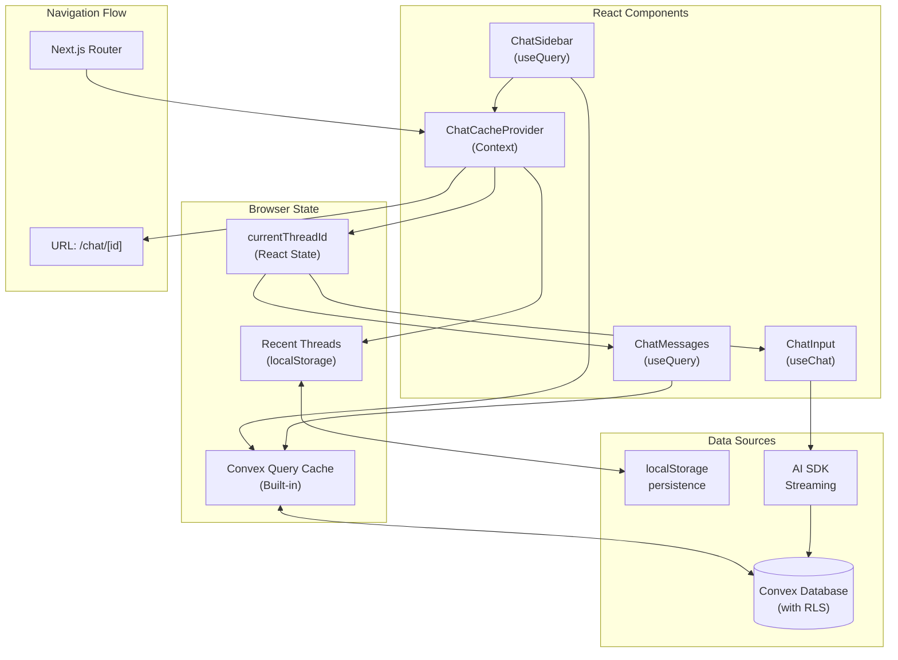
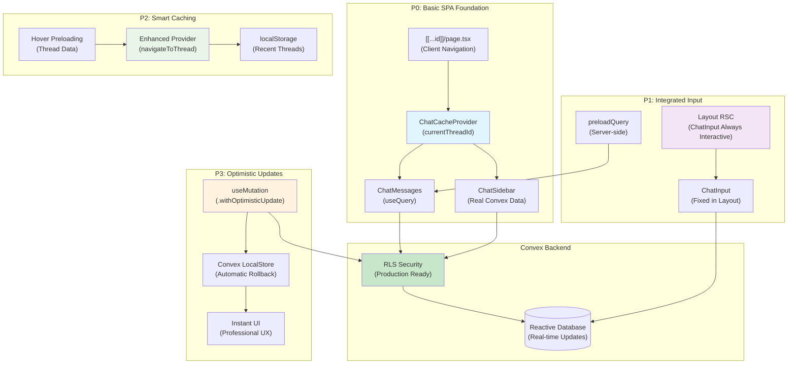

# Save

overall architecture diagram

```mermaid
graph TB
    subgraph "Browser State"
        CurrentThread["currentThreadId<br/>(React State)"]
        RecentCache["Recent Threads<br/>(localStorage)"]
        ConvexCache["Convex Query Cache<br/>(Built-in)"]
    end

    subgraph "Data Sources"
        LocalStorage[localStorage<br/>persistence]
        ConvexDB[("Convex Database<br/>(with RLS)")]
        AISDK["AI SDK<br/>Streaming"]
    end

    subgraph "React Components"
        Provider["ChatCacheProvider<br/>(Context)"]
        Sidebar["ChatSidebar<br/>(useQuery)"]
        Messages["ChatMessages<br/>(useQuery)"]
        Input["ChatInput<br/>(useChat)"]
    end

    subgraph "Navigation Flow"
        URL["URL: /chat/[id]"]
        Router["Next.js Router"]
    end

    Provider --> CurrentThread
    Provider --> RecentCache
    RecentCache <--> LocalStorage

    Sidebar --> ConvexCache
    Messages --> ConvexCache
    ConvexCache <--> ConvexDB

    Input --> AISDK
    AISDK --> ConvexDB

    CurrentThread --> Messages
    CurrentThread --> Input

    Sidebar --> Provider
    Router --> Provider
    Provider --> URL
```

diagram showing the evolution from P0 to P3.

```mermaid
graph TD
    subgraph "P0: Basic SPA Foundation"
        P0_Provider["ChatCacheProvider<br/>(currentThreadId)"]
        P0_Sidebar["ChatSidebar<br/>(Real Convex Data)"]
        P0_Messages["ChatMessages<br/>(useQuery)"]
        P0_Route["[[...id]]/page.tsx<br/>(Client Navigation)"]

        P0_Provider --> P0_Sidebar
        P0_Provider --> P0_Messages
        P0_Route --> P0_Provider
    end

    subgraph "P1: Integrated Input"
        P1_Layout["Layout RSC<br/>(ChatInput Always Interactive)"]
        P1_Preload["preloadQuery<br/>(Server-side)"]
        P1_Input["ChatInput<br/>(Fixed in Layout)"]

        P1_Layout --> P1_Input
        P1_Preload --> P0_Messages
    end

    subgraph "P2: Smart Caching"
        P2_Local["localStorage<br/>(Recent Threads)"]
        P2_Hover["Hover Preloading<br/>(Thread Data)"]
        P2_Cache["Enhanced Provider<br/>(navigateToThread)"]

        P2_Cache --> P2_Local
        P2_Hover --> P2_Cache
    end

    subgraph "P3: Optimistic Updates"
        P3_Mutation["useMutation<br/>(.withOptimisticUpdate)"]
        P3_LocalStore["Convex LocalStore<br/>(Automatic Rollback)"]
        P3_Instant["Instant UI<br/>(Professional UX)"]

        P3_Mutation --> P3_LocalStore
        P3_LocalStore --> P3_Instant
    end

    subgraph "Convex Backend"
        RLS["RLS Security<br/>(Production Ready)"]
        ReactiveDB[("Reactive Database<br/>(Real-time Updates)")]
    end

    P0_Sidebar --> RLS
    P0_Messages --> RLS
    P1_Input --> ReactiveDB
    P3_Mutation --> RLS
    RLS --> ReactiveDB

    style P0_Provider fill:#e1f5fe
    style P1_Layout fill:#f3e5f5
    style P2_Cache fill:#e8f5e8
    style P3_Mutation fill:#fff3e0
    style RLS fill:#c8e6c9
```
