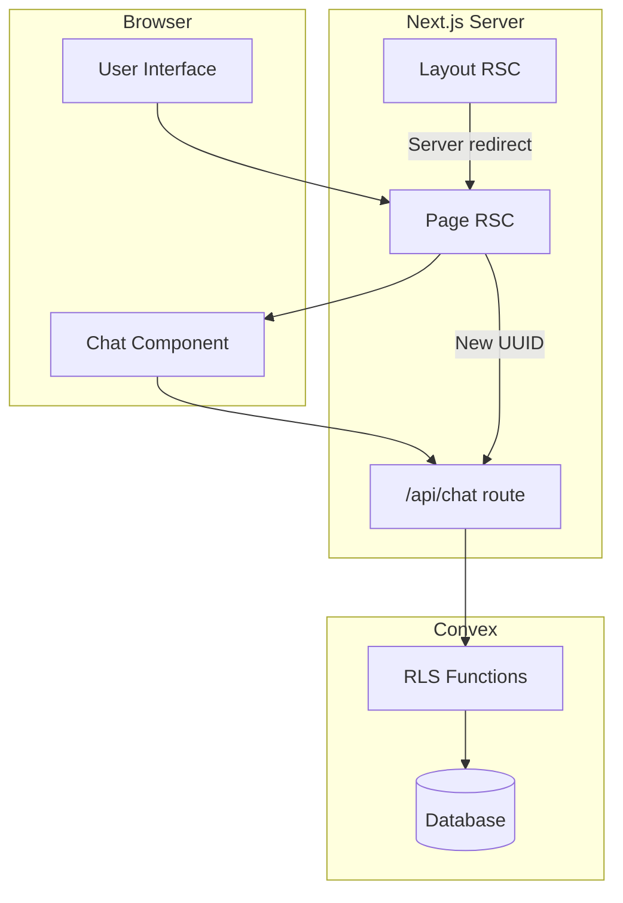
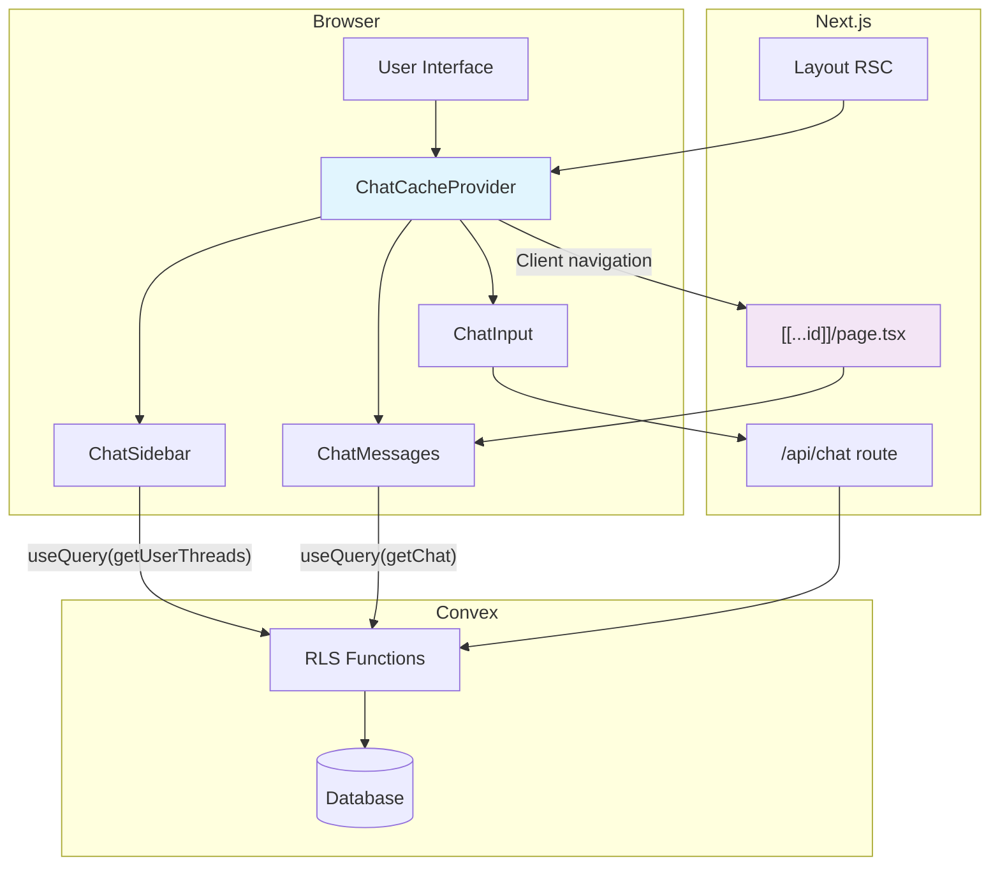
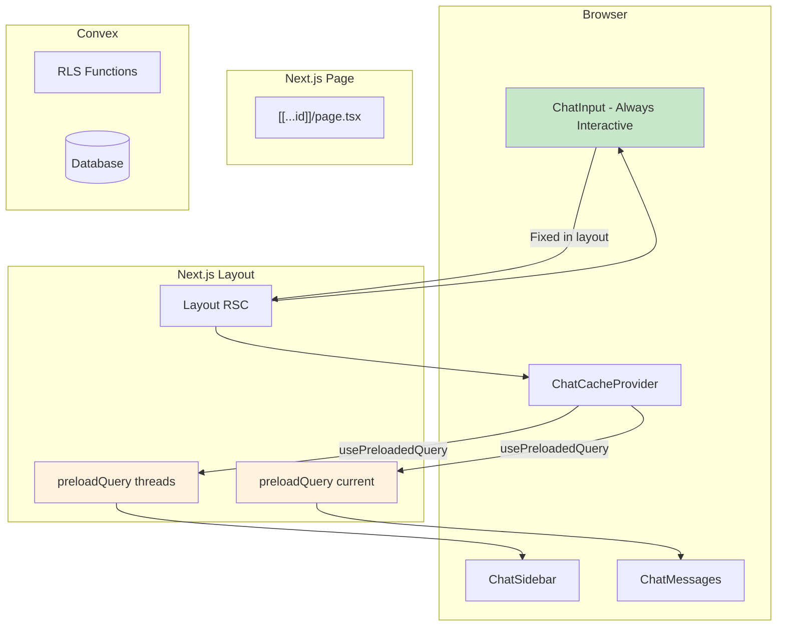
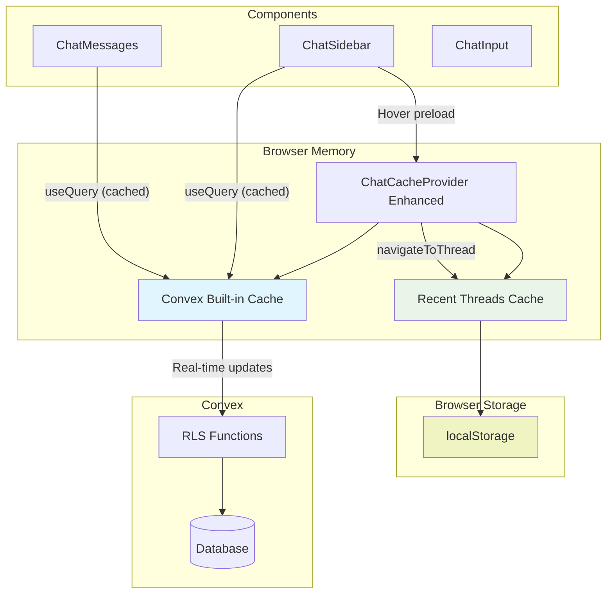
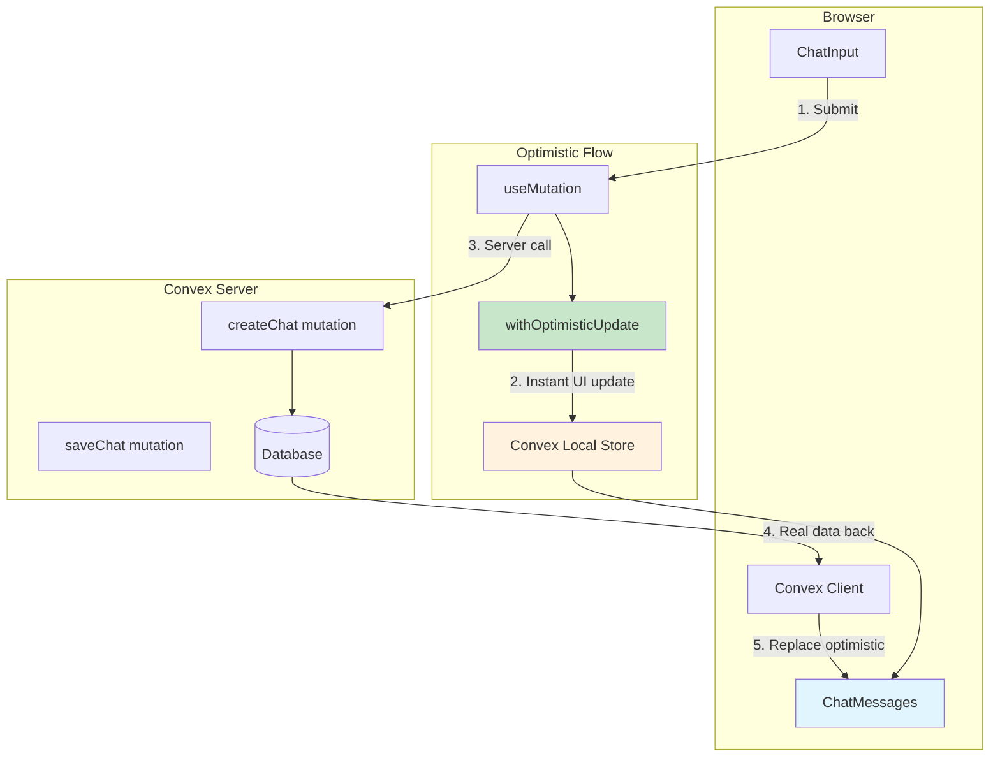
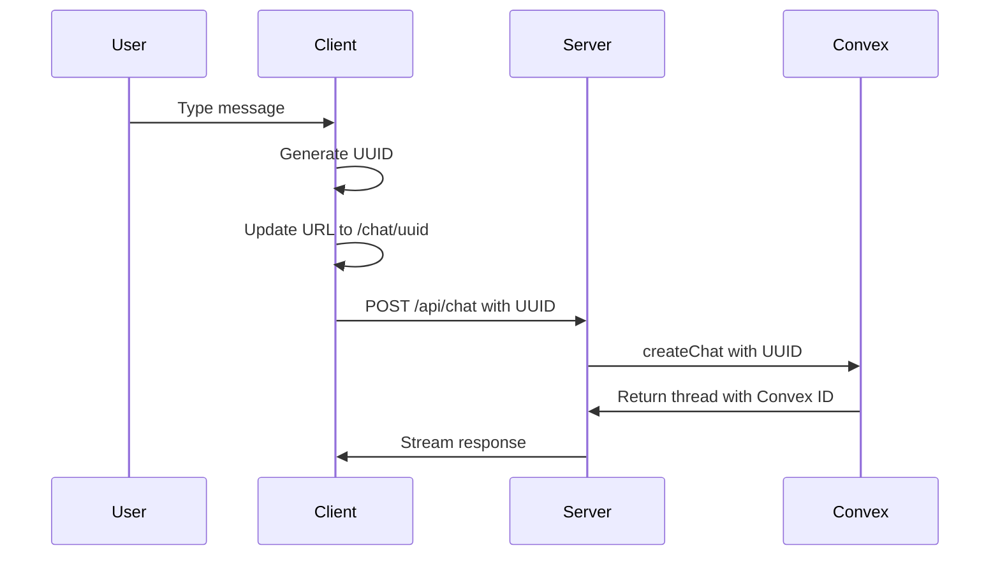
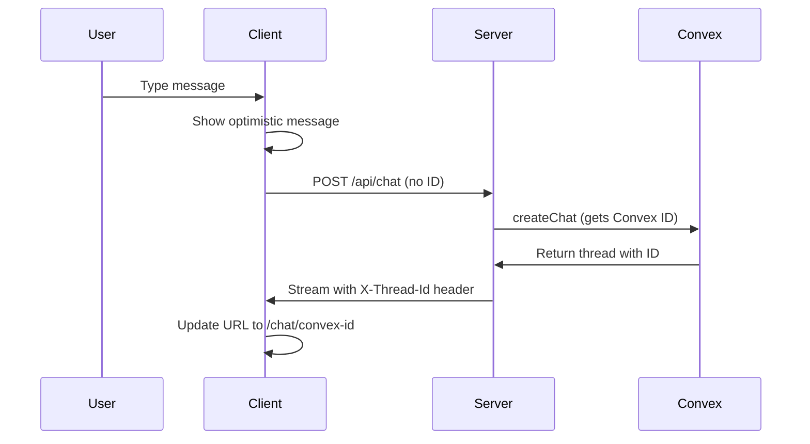
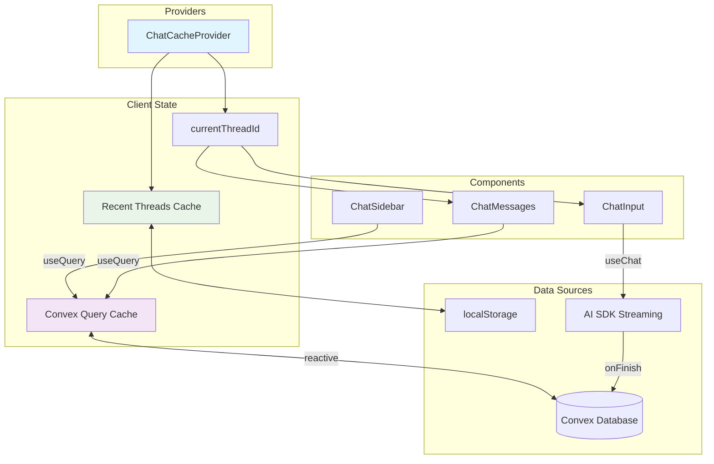

# Simplified Evolution Plan with Architecture Diagrams

## Your Concerns Addressed

1. **✅ Keep superjson**: You're right - if it works for dates, keep it for now
2. **✅ Convex IDs vs UUIDs**: We'll handle the workflow change properly
3. **✅ Convex built-in optimistic updates**: Much simpler than custom implementation
4. **✅ Step-by-step evolution**: Clear phases with diagrams

## Current State (P-1: Baseline)



**Problems:**

- Server-side redirects break SPA
- No client-side state management
- No thread caching between navigations

## P0: Basic SPA (2 days)

**Goal**: Client-side navigation with shared thread state



**What's Added:**

- ✅ `ChatCacheProvider` for shared state
- ✅ Catch-all route `[[...id]]/page.tsx`
- ✅ Client-side navigation (no server redirects)
- ✅ Real Convex data in sidebar

**Implementation:**

```typescript
// Phase P0 changes only:
// 1. Create ChatCacheProvider (basic version)
// 2. Replace server redirect with client navigation
// 3. Connect sidebar to real Convex data
```

## P1: Integrated Input + Server Preloading (1 day)

**Goal**: Always-interactive input + faster initial loads



**What's Added:**

- ✅ `ChatInput` moved to layout (always interactive)
- ✅ Server-side `preloadQuery` for faster initial loads
- ✅ `usePreloadedQuery` for seamless server-to-client data flow

## P2: Smart Caching (1 day)

**Goal**: Instant thread switching with localStorage persistence



**What's Added:**

- ✅ Recent threads localStorage persistence
- ✅ Hover preloading for instant navigation
- ✅ Smart cache invalidation

## P3: Convex Optimistic Updates (1 day)

**Goal**: Instant message feedback using Convex built-in features



**What's Added:**

- ✅ Convex built-in optimistic updates (much simpler!)
- ✅ Automatic rollback on errors
- ✅ Instant message appearance

**Simple Implementation:**

```typescript
// Using Convex built-in optimistic updates
const createThread = useMutation(api.chat.createChat).withOptimisticUpdate(
  (localStore, args) => {
    // Add optimistic message to local state
    const threads = localStore.getQuery(api.chat.getUserThreads, {});
    if (threads) {
      localStore.setQuery(api.chat.getUserThreads, {}, [
        ...threads.results,
        { ...args, _id: crypto.randomUUID(), isOptimistic: true },
      ]);
    }
  }
);
```

## UUID vs Convex ID Workflow

### Current (UUID approach):



### Proposed (Convex ID approach):



**Recommendation**: **Keep UUID approach for now**

- ✅ Simpler client-side logic
- ✅ URL updates immediately
- ✅ No workflow complexity
- ✅ Works well with optimistic updates

## Data Flow Architecture



## Implementation Timeline

### P0: Basic SPA (2 days)

```bash
Day 1:
- Create basic ChatCacheProvider
- Convert to catch-all route
- Remove server redirects

Day 2:
- Connect sidebar to real Convex data
- Test client-side navigation
```

### P1: Integrated Input (1 day)

```bash
- Move ChatInput to layout
- Add preloadQuery on server
- Test always-interactive input
```

### P2: Smart Caching (1 day)

```bash
- Add localStorage persistence
- Implement hover preloading
- Add navigation optimization
```

### P3: Optimistic Updates (1 day)

```bash
- Add Convex .withOptimisticUpdate()
- Test instant message feedback
- Add error handling
```

## Why This Approach Works

1. **Evolutionary**: Each phase builds on the previous
2. **Simple**: Uses Convex built-in features where possible
3. **Testable**: Each phase can be tested independently
4. **Rollback-safe**: Can stop at any phase if issues arise
5. **Real Benefits**: Each phase provides immediate UX improvements

This gives you a clear path from your current working app to a professional SPA experience, with minimal risk and maximum learning!
