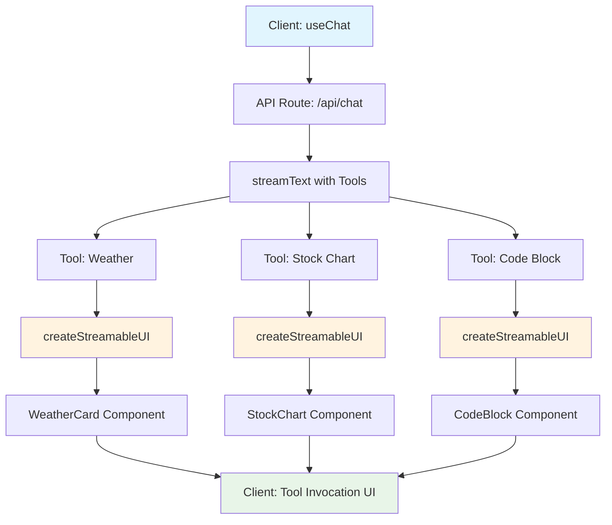

# Rich Chat Streams with Widgets

**Create ChatGPT-like experiences with interactive components**

[← Back to Overview](./README.md) | [Next: Rate Limiting →](./rate-limiting.md)

> **📌 AI SDK Version Guide**: This document focuses on **AI SDK v4 (stable)** patterns. V5 differences are noted in callout boxes.

## Overview

Transform your chat app from basic text responses to rich, interactive experiences with widgets like weather cards, stock charts, code blocks, and custom components that stream independently.

## Architecture: Multi-Widget Streaming



## Implementation: Server-Side Tools

### Core Pattern: Tool Invocations → React Components

> **✅ AI SDK v4 (Stable)** - This is the recommended approach

```typescript
// app/api/chat/route.ts - AI SDK v4 Pattern
import { streamText } from "ai";
import { openai } from "@ai-sdk/openai";
import { z } from "zod";

export async function POST(req: Request) {
  const { messages } = await req.json();

  const result = streamText({
    model: openai("gpt-4o"),
    messages,
    tools: {
      displayWeather: {
        description: "Display weather information with a rich card",
        parameters: z.object({
          city: z.string(),
          latitude: z.number(),
          longitude: z.number(),
        }),
        execute: async ({ city, latitude, longitude }) => {
          const weatherData = await getWeatherData({ latitude, longitude });
          return {
            city,
            temperature: weatherData.temperature,
            condition: weatherData.condition,
            forecast: weatherData.forecast,
          };
        },
      },

      displayStockChart: {
        description: "Show stock price with interactive chart",
        parameters: z.object({
          symbol: z.string(),
          period: z.enum(["1D", "1W", "1M", "1Y"]),
        }),
        execute: async ({ symbol, period }) => {
          const stockData = await getStockData({ symbol, period });
          return {
            symbol,
            currentPrice: stockData.price,
            change: stockData.change,
            chartData: stockData.history,
          };
        },
      },

      renderCodeBlock: {
        description: "Display code with syntax highlighting",
        parameters: z.object({
          code: z.string(),
          language: z.string(),
          explanation: z.string().optional(),
        }),
        execute: async ({ code, language, explanation }) => {
          return { code, language, explanation };
        },
      },
    },
  });

  return result.toDataStreamResponse();
}
```

> **🔮 AI SDK v5 Alpha**: The tool definition syntax will be simplified:
> ```typescript
> // v5 will have streamlined tool definitions
> tools: {
>   displayWeather: tool({
>     description: "Display weather information",
>     parameters: z.object({ /* ... */ }),
>     execute: async ({ city }) => { /* ... */ },
>   }),
> }
> ```
> [Learn more about v5 tools →](https://ai-sdk.dev/docs/announcing-ai-sdk-5-alpha#simplified-tool-definitions)

## Client-Side: Widget Rendering

### Generative UI with Tool Invocations (v4)

> **✅ AI SDK v4 (Stable)** - useChat with tool invocations

```typescript
// app/components/chat.tsx - AI SDK v4 Pattern
'use client'

import { useChat } from '@ai-sdk/react'
import { WeatherCard } from './widgets/weather-card'
import { StockChart } from './widgets/stock-chart'
import { CodeBlock } from './widgets/code-block'

export function Chat() {
  const { messages, input, setInput, handleSubmit } = useChat()

  return (
    <div className="max-w-4xl mx-auto">
      {messages.map(message => (
        <div key={message.id} className="mb-4">
          <div className="prose">{message.content}</div>

          {/* v4: Tool invocations render as components */}
          <div className="space-y-4">
            {message.toolInvocations?.map(tool => {
              if (tool.state === 'result') {
                switch (tool.toolName) {
                  case 'displayWeather':
                    return (
                      <WeatherCard
                        key={tool.toolCallId}
                        {...tool.result}
                        className="animate-fadeIn"
                      />
                    )

                  case 'displayStockChart':
                    return (
                      <StockChart
                        key={tool.toolCallId}
                        {...tool.result}
                        className="animate-slideUp"
                      />
                    )

                  case 'renderCodeBlock':
                    return (
                      <CodeBlock
                        key={tool.toolCallId}
                        {...tool.result}
                        className="animate-fadeIn"
                      />
                    )
                }
              } else {
                // Loading states with skeleton UIs
                return (
                  <div key={tool.toolCallId} className="animate-pulse">
                    {getLoadingComponent(tool.toolName)}
                  </div>
                )
              }
            })}
          </div>
        </div>
      ))}

      <ChatInput
        input={input}
        setInput={setInput}
        handleSubmit={handleSubmit}
      />
    </div>
  )
}
```

> **🔮 AI SDK v5 Alpha**: Enhanced tool invocation handling:
> ```typescript
> // v5 will have improved TypeScript inference
> {message.toolInvocations?.map(tool => {
>   // Better type safety and IDE support
>   return <ToolRenderer key={tool.id} invocation={tool} />
> })}
> ```
> [Learn more about v5 improvements →](https://ai-sdk.dev/docs/announcing-ai-sdk-5-alpha#improved-typescript-support)

## Advanced: Nested Streaming UI (RSC)

> **⚠️ Advanced Pattern** - Only use if you need complex server-side UI generation

```typescript
// Using AI SDK RSC for nested streaming (advanced use case)
'use server'

import { createStreamableUI } from 'ai/rsc'

export async function getComplexDashboard({ query }: { query: string }) {
  const mainUI = createStreamableUI()

  // Start with skeleton
  mainUI.update(<DashboardSkeleton />)

  // Create independent streams for each widget
  const weatherStream = createStreamableUI(<WeatherSkeleton />)
  const stockStream = createStreamableUI(<StockSkeleton />)
  const newsStream = createStreamableUI(<NewsSkeleton />)

  // Update main UI with streaming containers
  mainUI.update(
    <Dashboard>
      <div className="grid grid-cols-3 gap-4">
        <div>{weatherStream.value}</div>
        <div>{stockStream.value}</div>
        <div>{newsStream.value}</div>
      </div>
    </Dashboard>
  )

  // Each widget updates independently
  Promise.all([
    getWeatherData().then(data =>
      weatherStream.done(<WeatherCard {...data} />)
    ),
    getStockData().then(data =>
      stockStream.done(<StockChart {...data} />)
    ),
    getNewsData().then(data =>
      newsStream.done(<NewsFeed {...data} />)
    )
  ]).then(() => {
    mainUI.done()
  })

  return mainUI.value
}
```

> **🔮 AI SDK v5 Alpha**: Improved RSC patterns with better type safety and simplified APIs. Most apps should still prefer the v4 useChat pattern for maintainability.

## Version Feature Comparison

| Feature | AI SDK v4 (Stable) | AI SDK v5 (Alpha) | Recommendation |
|---------|-------------------|-------------------|----------------|
| **Tool Definitions** | `execute` function | `tool()` helper | ✅ Use v4 for stability |
| **Type Safety** | Good | Excellent | ⏳ Wait for v5 stable |
| **Tool Invocations** | `message.toolInvocations` | Enhanced API | ✅ v4 is production-ready |
| **RSC Integration** | Available | Improved | ⚠️ Complex for most apps |
| **Documentation** | Complete | Growing | ✅ v4 has full docs |

## Migration Strategy: v4 → v5

When v5 becomes stable, migration will be straightforward:

```typescript
// Current v4 code
const result = streamText({
  tools: {
    getWeather: {
      description: "Get weather",
      parameters: z.object({ city: z.string() }),
      execute: async ({ city }) => getWeatherData(city),
    },
  },
});

// Future v5 migration (when stable)
const result = streamText({
  tools: {
    getWeather: tool({
      description: "Get weather",
      parameters: z.object({ city: z.string() }),
      execute: async ({ city }) => getWeatherData(city),
    }),
  },
});
```

> **📋 Migration Checklist**:
> - ✅ Tool definitions: Minimal changes needed
> - ✅ Client components: Should work without changes  
> - ✅ Type definitions: Enhanced inference (benefit)
> - ⚠️ Testing: Validate all tool invocations work

## Terminology Quick Reference

| Term | Version | Usage | Example |
|------|---------|-------|---------|
| `useChat` | v4 & v5 | Client-side chat hook | `const { messages } = useChat()` |
| `streamText` | v4 & v5 | Server-side text streaming | `streamText({ model, messages, tools })` |
| `streamUI` | v4 & v5 RSC | Server component streaming | `streamUI({ model, tools })` |
| `tool()` helper | v5 only | Simplified tool definitions | `tool({ description, execute })` |
| `toolInvocations` | v4 | Tool results array | `message.toolInvocations?.map()` |
| `createStreamableUI` | RSC only | Server UI streaming | Complex dashboard patterns |

## Widget Examples

### Weather Card Component

```typescript
// components/widgets/weather-card.tsx
interface WeatherCardProps {
  city: string
  temperature: number
  condition: string
  forecast: Array<{ day: string; high: number; low: number }>
  className?: string
}

export function WeatherCard({ city, temperature, condition, forecast, className }: WeatherCardProps) {
  return (
    <div className={`bg-gradient-to-br from-blue-400 to-blue-600 rounded-lg p-6 text-white ${className}`}>
      <div className="flex items-center justify-between mb-4">
        <h3 className="text-xl font-semibold">{city}</h3>
        <span className="text-3xl font-bold">{temperature}°</span>
      </div>
      
      <p className="text-blue-100 mb-4">{condition}</p>
      
      <div className="grid grid-cols-4 gap-2">
        {forecast.map((day, index) => (
          <div key={index} className="text-center">
            <div className="text-xs text-blue-200">{day.day}</div>
            <div className="text-sm">{day.high}°</div>
            <div className="text-xs text-blue-300">{day.low}°</div>
          </div>
        ))}
      </div>
    </div>
  )
}
```

### Stock Chart Component

```typescript
// components/widgets/stock-chart.tsx
import { LineChart, Line, XAxis, YAxis, ResponsiveContainer } from 'recharts'

interface StockChartProps {
  symbol: string
  currentPrice: number
  change: number
  chartData: Array<{ time: string; price: number }>
  className?: string
}

export function StockChart({ symbol, currentPrice, change, chartData, className }: StockChartProps) {
  const isPositive = change >= 0

  return (
    <div className={`bg-white rounded-lg border p-6 ${className}`}>
      <div className="flex items-center justify-between mb-4">
        <h3 className="text-xl font-semibold">{symbol}</h3>
        <div className="text-right">
          <div className="text-2xl font-bold">${currentPrice.toFixed(2)}</div>
          <div className={`text-sm ${isPositive ? 'text-green-600' : 'text-red-600'}`}>
            {isPositive ? '+' : ''}{change.toFixed(2)} ({((change / currentPrice) * 100).toFixed(2)}%)
          </div>
        </div>
      </div>
      
      <div className="h-48">
        <ResponsiveContainer width="100%" height="100%">
          <LineChart data={chartData}>
            <XAxis dataKey="time" />
            <YAxis />
            <Line
              type="monotone"
              dataKey="price"
              stroke={isPositive ? "#10b981" : "#ef4444"}
              strokeWidth={2}
              dot={false}
            />
          </LineChart>
        </ResponsiveContainer>
      </div>
    </div>
  )
}
```

## Implementation Best Practices

### Loading States

```typescript
function getLoadingComponent(toolName: string) {
  switch (toolName) {
    case 'displayWeather':
      return <WeatherSkeleton />
    case 'displayStockChart':
      return <StockSkeleton />
    case 'renderCodeBlock':
      return <CodeSkeleton />
    default:
      return <GenericSkeleton />
  }
}

function WeatherSkeleton() {
  return (
    <div className="bg-gray-200 rounded-lg p-6 animate-pulse">
      <div className="flex justify-between mb-4">
        <div className="h-6 bg-gray-300 rounded w-24"></div>
        <div className="h-8 bg-gray-300 rounded w-16"></div>
      </div>
      <div className="h-4 bg-gray-300 rounded w-32 mb-4"></div>
      <div className="grid grid-cols-4 gap-2">
        {[...Array(4)].map((_, i) => (
          <div key={i} className="h-12 bg-gray-300 rounded"></div>
        ))}
      </div>
    </div>
  )
}
```

### Error Boundaries

```typescript
// components/widget-error-boundary.tsx
import { Component, ReactNode } from 'react'

interface Props {
  children: ReactNode
  toolName: string
}

interface State {
  hasError: boolean
}

export class WidgetErrorBoundary extends Component<Props, State> {
  constructor(props: Props) {
    super(props)
    this.state = { hasError: false }
  }

  static getDerivedStateFromError(): State {
    return { hasError: true }
  }

  render() {
    if (this.state.hasError) {
      return (
        <div className="bg-red-50 border border-red-200 rounded-lg p-4">
          <p className="text-red-800">Failed to load {this.props.toolName} widget</p>
          <button 
            onClick={() => this.setState({ hasError: false })}
            className="mt-2 text-red-600 hover:text-red-800"
          >
            Try again
          </button>
        </div>
      )
    }

    return this.props.children
  }
}
```

## Performance Considerations

- **Lazy Loading**: Load widget components only when needed
- **Virtual Scrolling**: For long message histories with many widgets
- **Animation Timing**: Stagger widget animations to avoid jarring effects
- **Bundle Splitting**: Keep widget code in separate chunks

## Real-World Use Cases

### Financial Dashboard
- Stock prices, charts, portfolio analytics
- Real-time market data streaming
- Interactive trading interfaces

### Development Tools
- Code execution environments
- API documentation widgets
- Database query results

### Content Creation
- Image generation previews
- Video embedding
- Document templates

## Related Topics

- **[Rate Limiting](./rate-limiting.md)**: Protect widget APIs from abuse
- **[Stream Resumability](./stream-resumability.md)**: Ensure widgets complete even on disconnect
- **[Chat History](./chat-history.md)**: Store widget state for perfect restoration

---

**Next Steps**: Implement basic weather and code widgets, then explore [Rate Limiting](./rate-limiting.md) to protect your widget APIs.

## 📖 References & Sources

### AI SDK Documentation
- **[AI SDK Generative UI](https://ai-sdk.dev/docs/ai-sdk-ui/generative-user-interfaces)** - Official tool invocation patterns
- **[AI SDK Tools](https://ai-sdk.dev/docs/ai-sdk-core/tools-and-tool-calling)** - Tool definition and execution
- **[Multiple Streamables](https://ai-sdk.dev/docs/advanced/multiple-streamables)** - Nested streaming UI patterns
- **[AI SDK RSC](https://ai-sdk.dev/docs/ai-sdk-rsc/overview)** - Server component streaming

### Widget Implementation Examples
- **[Weather API Integration](https://openweathermap.org/api)** - OpenWeatherMap API documentation
- **[Stock Chart Libraries](https://recharts.org/)** - Recharts for React chart components
- **[Syntax Highlighting](https://prismjs.com/)** - PrismJS for code block highlighting

### Design & UX References
- **[Tailwind CSS](https://tailwindcss.com/docs)** - Utility-first CSS framework
- **[Headless UI](https://headlessui.com/)** - Accessible UI components
- **[React Aria](https://react-spectrum.adobe.com/react-aria/)** - Accessibility patterns

### Performance & Best Practices
- **[React Performance](https://react.dev/learn/render-and-commit)** - Component optimization
- **[Bundle Analysis](https://nextjs.org/docs/app/building-your-application/optimizing/bundle-analyzer)** - Code splitting strategies
- **[Error Boundaries](https://react.dev/reference/react/Component#catching-rendering-errors-with-an-error-boundary)** - Error handling patterns 