# RSC vs UI SDK: Decision Matrix

**Choose the right AI SDK approach for your chat application**

[← Back to Overview](./README.md) | [← Stream Resumability](./stream-resumability.md) | [Next: Features Prioritization →](./features-prioritization.md)

## 🗺️ Terminology Quick Reference (Cheat Sheet)

> **Confused by the terminology?** Use this guide to identify what approach you're looking at:

| If you see... | It means... | Approach | Complexity |
|---------------|-------------|----------|------------|
| `useChat` | Client-side hook | **AI SDK UI** | ⭐⭐ Simple |
| `message.toolInvocations` | Tool results array | **AI SDK UI** | ⭐⭐ Simple |
| `streamText()` | Server text streaming | **AI SDK UI** | ⭐⭐ Simple |
| `tool.execute()` | Tool function | **AI SDK UI** | ⭐⭐ Simple |
| | | |
| `streamUI()` | Server UI streaming | **AI SDK RSC** | ⭐⭐⭐⭐⭐ Complex |
| `createStreamableUI()` | Streaming components | **AI SDK RSC** | ⭐⭐⭐⭐⭐ Complex |
| `'use server'` | Server actions | **AI SDK RSC** | ⭐⭐⭐⭐⭐ Complex |
| `tool.generate()` | Streaming UI generator | **AI SDK RSC** | ⭐⭐⭐⭐⭐ Complex |

## 🎯 Quick Decision Guide

```mermaid
flowchart TD
    A["🤔 Which AI SDK approach?"] --> B{Are you building ChatGPT-like UI?}
    
    B -->|Yes| C["Standard chat with occasional widgets"]
    B -->|No| D["Complex dashboard/multi-UI app"]
    
    C --> E["✅ Use AI SDK UI<br/>• useChat hook<br/>• Tool invocations<br/>• 90% of apps"]
    
    D --> F{Do you have RSC expertise?}
    
    F -->|Yes| G["✅ AI SDK RSC<br/>• Complex server streaming<br/>• Multiple concurrent UIs"]
    F -->|No| H["✅ AI SDK UI + creativity<br/>• Still very powerful<br/>• Much easier to maintain"]
    
    style E fill:#e8f5e8
    style G fill:#fff3e0
    style H fill:#e8f5e8
```



## 🚨 Critical Recommendation

> **90% of applications should use AI SDK UI (`useChat`)**  
> Only choose RSC if you have specific server-side UI generation needs AND RSC expertise.

## Overview

The Vercel AI SDK offers two primary approaches: AI SDK UI (with hooks like `useChat`) and AI SDK RSC (React Server Components with `streamUI`). Choose the right pattern for your use case.

## Architectural Comparison

| Aspect                | AI SDK UI (useChat)             | AI SDK RSC (streamUI)            |
| --------------------- | ------------------------------- | -------------------------------- |
| **Complexity**        | ⭐⭐ Simple                     | ⭐⭐⭐⭐⭐ Complex               |
| **Setup**             | Standard Next.js API routes     | React Server Components required |
| **UI Flexibility**    | Client-side component rendering | Server-side component streaming  |
| **Performance**       | Good (client rendering)         | Excellent (server streaming)     |
| **Real-time Updates** | Tool invocations                | Nested streamable UI             |
| **Bundle Size**       | Larger (client components)      | Smaller (server components)      |
| **Maintenance**       | Easier                          | More complex                     |
| **Use Case**          | Standard chat apps              | Complex generative UIs           |

## Decision Framework

```mermaid
flowchart TD
    A["Chat App Requirements"] --> B{Need Complex Widgets?}
    
    B -->|No| C["Standard Chat Interface"]
    B -->|Yes| D{Multiple Dynamic Components?}
    
    C --> E["✅ Use AI SDK UI<br/>• useChat hook<br/>• Tool invocations<br/>• Client-side rendering"]
    
    D -->|No| F["Simple Widgets"]
    D -->|Yes| G["Complex Dashboard"]
    
    F --> H["✅ Use AI SDK UI<br/>• Tool invocations<br/>• Component mapping<br/>• Simpler maintenance"]
    
    G --> I["✅ Use AI SDK RSC<br/>• streamUI<br/>• Nested streaming<br/>• Server components"]
    
    style E fill:#e8f5e8
    style H fill:#e8f5e8
    style I fill:#fff3e0
```



## When to Use AI SDK UI (Recommended)

### ✅ Perfect For:
- **Standard chat interfaces** with occasional widgets
- **Teams new to AI SDK** (easier learning curve)
- **Rapid prototyping** and MVP development
- **Client-side rich interactions** (animations, state management)
- **Simple tool invocations** (weather, calculations, API calls)
- **90% of chat applications**

### Terminology You'll See:
- `useChat()` - Main chat hook
- `message.toolInvocations` - Tool results
- `streamText()` - Server streaming
- `tool.execute()` - Tool functions

### Implementation Pattern

```typescript
// ✅ AI SDK UI - Standard approach (recommended for most apps)
// app/api/chat/route.ts
export async function POST(req: Request) {
  const result = streamText({
    model: openai('gpt-4o'),
    messages,
    tools: {
      getWeather: {
        description: 'Get weather data',
        parameters: z.object({ city: z.string() }),
        execute: async ({ city }) => {
          const data = await getWeatherData(city)
          return data // Just return data, not JSX
        }
      },
      
      calculateTip: {
        description: 'Calculate tip amount',
        parameters: z.object({ 
          amount: z.number(), 
          percentage: z.number() 
        }),
        execute: async ({ amount, percentage }) => {
          return { 
            tip: amount * (percentage / 100),
            total: amount + (amount * (percentage / 100))
          }
        }
      }
    }
  })

  return result.toDataStreamResponse()
}

// app/components/chat.tsx
export function Chat() {
  const { messages } = useChat()

  return (
    <div>
      {messages.map(message => (
        <div key={message.id}>
          <div>{message.content}</div>

          {/* Tool invocations render as components */}
          {message.toolInvocations?.map(tool => {
            if (tool.state === 'result') {
              switch (tool.toolName) {
                case 'getWeather':
                  return <WeatherCard key={tool.toolCallId} {...tool.result} />
                case 'calculateTip':
                  return <TipCalculator key={tool.toolCallId} {...tool.result} />
              }
            }
            return <Skeleton key={tool.toolCallId} />
          })}
        </div>
      ))}
    </div>
  )
}
```

### Benefits

1. **Simple mental model**: Tools return data, client renders components
2. **Easy debugging**: Standard React patterns and dev tools
3. **Flexible styling**: Full control over component styling and animations
4. **Fast iteration**: Changes don't require server component knowledge
5. **Great DX**: TypeScript inference works well with tool results

## When to Use AI SDK RSC (Advanced)

### ✅ Perfect For:
- **Complex generative UIs** that need server-side rendering
- **Performance-critical applications** with heavy components
- **Real-time dashboards** with multiple streaming widgets
- **Advanced streaming patterns** with nested UI updates
- **Enterprise applications** where bundle size matters
- **Teams with deep RSC expertise**

### Terminology You'll See:
- `streamUI()` - Server UI streaming
- `createStreamableUI()` - Streaming components
- `'use server'` - Server actions
- `tool.generate()` - UI generators

### Implementation Pattern

```typescript
// ⚠️ AI SDK RSC - Advanced approach (complex but powerful)
// app/actions.ts
'use server'

import { streamUI } from 'ai/rsc'
import { openai } from '@ai-sdk/openai'

export async function streamDashboard(query: string) {
  const result = await streamUI({
    model: openai('gpt-4o'),
    prompt: query,
    text: ({ content }) => <div className="prose">{content}</div>,
    tools: {
      createDashboard: {
        description: 'Create a complex dashboard with multiple widgets',
        parameters: z.object({
          metrics: z.array(z.string()),
          timeframe: z.string(),
          layout: z.enum(['grid', 'column', 'row'])
        }),
        generate: async function* ({ metrics, timeframe, layout }) {
          // Yield loading state immediately
          yield <DashboardSkeleton metrics={metrics} layout={layout} />

          // Create independent streams for each metric
          const widgets = await Promise.all(
            metrics.map(async (metric) => {
              const data = await fetchMetricData(metric, timeframe)
              return <MetricWidget key={metric} data={data} />
            })
          )

          // Return final composed dashboard
          return (
            <Dashboard layout={layout}>
              {widgets}
            </Dashboard>
          )
        }
      },
      
      createChart: {
        description: 'Create an interactive chart',
        parameters: z.object({
          type: z.enum(['line', 'bar', 'pie']),
          data: z.array(z.any())
        }),
        generate: async function* ({ type, data }) {
          yield <ChartSkeleton type={type} />
          
          // Server-side chart generation
          const chartComponent = await generateChart(type, data)
          return chartComponent
        }
      }
    }
  })

  return result.value
}

// app/page.tsx - Using server actions
export default function Page() {
  const [dashboard, setDashboard] = useState<React.ReactNode>()

  const handleGenerateDashboard = async (query: string) => {
    const result = await streamDashboard(query)
    setDashboard(result)
  }

  return (
    <div>
      <DashboardInput onSubmit={handleGenerateDashboard} />
      {dashboard}
    </div>
  )
}
```

### Benefits

1. **Server-side rendering**: Components render on server, stream to client
2. **Reduced bundle size**: No client-side component code
3. **Advanced streaming**: Nested UI updates with multiple concurrent streams
4. **Performance**: Heavy computations happen server-side
5. **Dynamic components**: Generate components based on LLM responses

### Drawbacks

1. **Complex setup**: Requires deep understanding of RSC
2. **Limited interactivity**: Client-side interactions need careful handling
3. **Debugging complexity**: Server components harder to debug
4. **Framework dependency**: Tied closely to Next.js App Router
5. **Learning curve**: Steep for developers new to RSC

## Migration Strategies

### From RSC to UI (Recommended Path)

According to AI SDK v5 documentation, the migration favors moving **from** RSC **to** UI patterns for better maintainability:

```typescript
// Before (RSC) - Complex server-side streaming
const { value: stream } = await streamUI({
  model: openai('gpt-4o'),
  tools: {
    displayWeather: {
      generate: async function* ({ location }) {
        yield <LoadingWeather />
        const weather = await getWeather(location)
        return <WeatherCard weather={weather} />
      }
    }
  }
})

// After (UI) - Simpler client-side rendering
const result = streamText({
  model: openai('gpt-4o'),
  tools: {
    displayWeather: {
      execute: async ({ location }) => {
        const weather = await getWeather(location)
        return weather // Return data, not JSX
      }
    }
  }
})

// Client handles rendering with tool invocations
{message.toolInvocations?.map(tool => {
  if (tool.toolName === 'displayWeather' && tool.state === 'result') {
    return <WeatherCard {...tool.result} />
  }
})}
```

### Why This Migration Makes Sense

1. **Simpler maintenance**: UI patterns are easier to understand and debug
2. **Better TypeScript support**: Tool results have better type inference
3. **Flexible rendering**: Client can choose how to render based on context
4. **Easier testing**: Standard React component testing patterns
5. **Framework agnostic**: Less tied to specific Next.js features

## Real-World Decision Examples

### Example 1: E-commerce Chat Assistant

**Requirements**: Product search, price comparisons, order tracking
**Recommendation**: **AI SDK UI**

```typescript
tools: {
  searchProducts: { /* returns product data */ },
  getOrderStatus: { /* returns order info */ },
  compareItems: { /* returns comparison data */ }
}

// Simple client-side rendering of product cards, order status, etc.
```

### Example 2: Financial Dashboard Generator

**Requirements**: Real-time charts, complex layouts, server-side calculations
**Recommendation**: **AI SDK RSC** (if team has RSC expertise)

```typescript
tools: {
  generatePortfolio: {
    generate: async function* () {
      yield <PortfolioSkeleton />
      // Heavy server-side calculations
      return <InteractivePortfolio />
    }
  }
}
```

### Example 3: Customer Support Chat

**Requirements**: Ticket creation, knowledge base search, file uploads
**Recommendation**: **AI SDK UI**

```typescript
tools: {
  searchKnowledgeBase: { /* returns articles */ },
  createTicket: { /* returns ticket info */ },
  uploadFile: { /* returns file status */ }
}

// Standard chat interface with occasional widgets
```

## Performance Comparison

### Bundle Size Impact

```typescript
// AI SDK UI - Client bundles include:
// - React components for widgets
// - Chart libraries (if used)
// - Heavy dependencies

// AI SDK RSC - Client bundles include:
// - Minimal React hydration code
// - No widget component code
// - Smaller overall bundle

// Real numbers (example app):
// UI: ~200KB additional bundle
// RSC: ~50KB additional bundle
```

### Runtime Performance

```typescript
// AI SDK UI
// ✅ Fast initial renders (cached components)
// ✅ Smooth client-side interactions
// ❌ Heavy computations block UI thread

// AI SDK RSC  
// ✅ Server handles heavy computations
// ✅ Streaming prevents blocking
// ❌ Network latency for each update
```

## Recommendation Matrix

| App Type               | Complexity | Team Experience | Recommendation |
| ---------------------- | ---------- | --------------- | -------------- |
| **MVP/Prototype**      | Low        | Any             | **AI SDK UI**  |
| **Standard Chat**      | Medium     | Any             | **AI SDK UI**  |
| **Advanced Dashboard** | High       | RSC Expert      | **AI SDK RSC** |
| **Advanced Dashboard** | High       | React Standard  | **AI SDK UI**  |
| **Enterprise App**     | High       | Mixed           | **AI SDK UI**  |

## Summary: Our Recommendation

> **Start with AI SDK UI for 90% of applications**

### Why AI SDK UI is Usually Better

1. **Easier to understand and maintain**
2. **Better developer experience**
3. **More flexible for client-side interactions**
4. **Easier to test and debug**
5. **Framework agnostic patterns**

### Only Choose RSC If:

- You have **deep RSC expertise** on your team
- You need **complex server-side UI generation**
- **Bundle size is critical** (mobile, low bandwidth)
- You're building **real-time dashboards** with heavy computations

## Related Topics

- **[Rich Streaming](./rich-streaming.md)**: Implement widgets with either approach
- **[Stream Resumability](./stream-resumability.md)**: Works with both UI and RSC patterns
- **[Features Prioritization](./features-prioritization.md)**: Choose features based on your SDK choice

---

**Next Steps**: Choose AI SDK UI for most applications, then implement [Rich Streaming](./rich-streaming.md) widgets with tool invocations.

## 📖 References & Sources

### AI SDK Architecture Documentation
- **[AI SDK React (useChat)](https://ai-sdk.dev/docs/ai-sdk-react)** - Client-side hooks and patterns
- **[AI SDK RSC](https://ai-sdk.dev/docs/ai-sdk-rsc)** - React Server Components integration
- **[streamText vs streamUI](https://ai-sdk.dev/docs/ai-sdk-core/generating-text#streamtext-vs-streamui)** - Core differences
- **[Migration Guide](https://ai-sdk.dev/docs/ai-sdk-ui/migration)** - Transitioning between patterns

### React Server Components
- **[Next.js App Router](https://nextjs.org/docs/app/building-your-application/rendering/server-components)** - RSC implementation
- **[React Server Components](https://react.dev/blog/2023/03/22/react-labs-what-we-have-been-working-on-march-2023#react-server-components)** - Official React documentation
- **[RSC from Scratch](https://github.com/reactwg/server-components/discussions/5)** - Deep dive into RSC concepts

### Performance & Bundle Analysis
- **[Next.js Bundle Analyzer](https://nextjs.org/docs/app/building-your-application/optimizing/bundle-analyzer)** - Client bundle optimization
- **[React DevTools Profiler](https://react.dev/learn/react-developer-tools#profiler)** - Component performance analysis
- **[Core Web Vitals](https://web.dev/vitals/)** - Performance metrics

### Client-Side State Management
- **[React useState](https://react.dev/reference/react/useState)** - Local state patterns
- **[React Context](https://react.dev/learn/passing-data-deeply-with-context)** - Global state management
- **[SWR](https://swr.vercel.app/)** - Data fetching patterns

### Architecture Decision Records
- **[ADR Template](https://github.com/joelparkerhenderson/architecture-decision-record)** - Decision documentation
- **[React Architecture Patterns](https://martinfowler.com/articles/micro-frontends.html)** - Large-scale application structure
- **[Component Design Systems](https://design-system.service.gov.uk/components/)** - Scalable UI patterns

### Real-world Implementation Examples
- **[Vercel Dashboard](https://vercel.com/blog/partial-prerendering-with-next-js-creating-a-new-default-rendering-model)** - RSC in production
- **[ChatGPT Interface Patterns](https://openai.com/blog/chatgpt-plugins)** - Tool invocation UX
- **Bundle Size Comparisons** - Performance metrics (*Note: Specific bundle sizes are illustrative and vary based on implementation*)

### Development Experience
- **[TypeScript with RSC](https://nextjs.org/docs/app/building-your-application/configuring/typescript)** - Type safety patterns
- **[Testing Server Components](https://nextjs.org/docs/app/building-your-application/testing)** - Testing strategies
- **[Debugging RSC](https://nextjs.org/docs/app/building-your-application/configuring/debugging)** - Development tools 