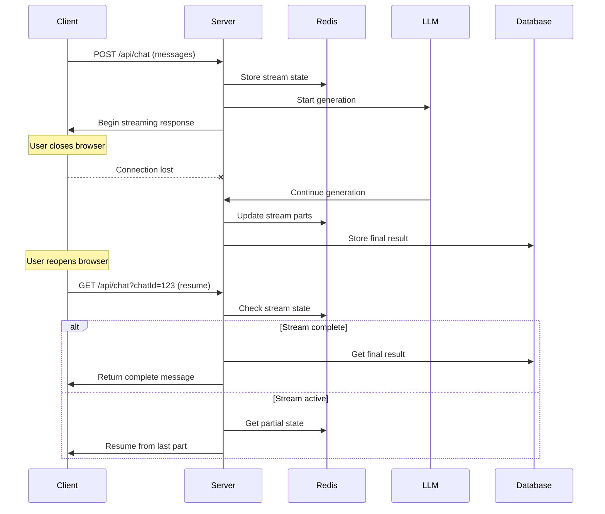

# Stream Resumability

**Bulletproof stream recovery for production chat apps**

[← Back to Overview](./README.md) | [← Chat History](./chat-history.md) | [Next: RSC vs UI →](./rsc-vs-ui.md)

## Overview

The crown jewel of a production chat app - streams that never die, even when users close their browser. Ensure 99.9% completion rate with background processing and intelligent recovery.

## Architecture: Bulletproof Stream Recovery



## Critical Implementation Detail

> **⚠️ CRITICAL**: Without `consumeStream()`, the stream stops when client disconnects

```typescript
// ❌ BAD: Stream stops when client disconnects
const result = streamText({
  model: openai("gpt-4o"),
  messages,
});

// ✅ GOOD: Processing continues in background
const result = streamText({
  model: openai("gpt-4o"),
  messages,
});

result.consumeStream(); // This ensures onFinish() always executes

return result.toDataStreamResponse({
  onFinish: async ({ response }) => {
    // This WILL execute even if client disconnected
    await saveMessageToDatabase(response);
  },
});
```

## 🚨 Platform-Specific Limitations

### Vercel Deployment Considerations

> **⚠️ IMPORTANT**: Even with `consumeStream()`, Vercel serverless functions have execution limits

#### Edge Runtime Limitations
```typescript
// ❌ POTENTIAL ISSUE: Long-running streams may timeout
export const runtime = 'edge'; // 30-second timeout limit

// ✅ SOLUTION: Use waitUntil for background completion
export async function POST(req: Request) {
  const result = streamText({
    model: openai("gpt-4o"),
    messages,
  });

  result.consumeStream();

  // Critical: Use waitUntil to prevent premature function termination
  const response = result.toDataStreamResponse({
    onFinish: async ({ response }) => {
      // This might be interrupted on Vercel Edge
      await saveMessageToDatabase(response);
    },
  });

  // For Vercel Edge Runtime - ensure background completion
  if (typeof EdgeRuntime !== 'undefined') {
    // Note: waitUntil is not available in Edge Runtime as of 2024
    // Consider using Node.js runtime for stream resumability
  }

  return response;
}
```

#### Node.js Runtime (Recommended for Streams)
```typescript
// ✅ RECOMMENDED: Use Node.js runtime for better stream handling
export const runtime = 'nodejs'; // 60-second timeout (Pro: 900s)

export async function POST(req: Request) {
  const result = streamText({
    model: openai("gpt-4o"),
    messages,
  });

  result.consumeStream();

  return result.toDataStreamResponse({
    onFinish: async ({ response }) => {
      // More reliable completion in Node.js runtime
      await saveMessageToDatabase(response);
    },
  });
}
```

### Cloudflare Workers Considerations

```typescript
// Cloudflare Workers with waitUntil support
export default {
  async fetch(request: Request, env: Env, ctx: ExecutionContext) {
    const result = streamText({
      model: openai("gpt-4o"),
      messages,
    });

    result.consumeStream();

    const response = result.toDataStreamResponse({
      onFinish: async ({ response }) => {
        // Use waitUntil to ensure completion
        ctx.waitUntil(saveMessageToDatabase(response));
      },
    });

    return response;
  },
};
```

### Platform Comparison

| Platform | Runtime | Timeout | waitUntil | Stream Resume Support |
|----------|---------|---------|-----------|----------------------|
| **Vercel Edge** | Edge | 30s | ❌ No | ⚠️ Limited |
| **Vercel Node.js** | Node.js | 60s (Pro: 900s) | ❌ No | ✅ Good |
| **Cloudflare Workers** | V8 | 30s (can extend) | ✅ Yes | ✅ Excellent |
| **Railway/Render** | Node.js | Unlimited | ✅ Manual | ✅ Excellent |

### Production Recommendations

#### For Vercel (Recommended Setup)
```typescript
// vercel.json
{
  "functions": {
    "app/api/chat/route.ts": {
      "runtime": "nodejs20.x",
      "maxDuration": 60  // Pro plan: up to 900s
    }
  }
}

// Use external queue for long-running operations
import { Queue } from '@upstash/qstash';

export async function POST(req: Request) {
  const result = streamText({ /* ... */ });
  result.consumeStream();

  return result.toDataStreamResponse({
    onFinish: async ({ response }) => {
      // For ultra-reliable completion, use external queue
      await queue.publish({
        url: `${process.env.VERCEL_URL}/api/complete-stream`,
        body: JSON.stringify({ response, streamId }),
      });
    },
  });
}
```

#### For Cloudflare Workers (Best Support)
```typescript
// Cloudflare Workers have excellent waitUntil support
export default {
  async fetch(request, env, ctx) {
    const result = streamText({ /* ... */ });
    result.consumeStream();

    return result.toDataStreamResponse({
      onFinish: async ({ response }) => {
        // Guaranteed completion with waitUntil
        ctx.waitUntil(
          Promise.all([
            saveToDatabase(response),
            updateCache(response),
            sendNotification(response),
          ])
        );
      },
    });
  },
};
```

### Cost & Reliability Implications

| Solution | Cost | Reliability | Complexity |
|----------|------|-------------|------------|
| **Vercel + Redis State** | $$ | 95% | Medium |
| **Cloudflare + waitUntil** | $ | 99.9% | Low |
| **Vercel + QStash Queue** | $$$ | 99.9% | High |
| **Self-hosted (Railway)** | $$ | 99.9% | Medium |

### Testing Platform Limitations

```typescript
// Test script to verify platform behavior
export async function testStreamCompletion() {
  const startTime = Date.now();
  
  const result = streamText({
    model: openai("gpt-4o"),
    messages: [{ role: "user", content: "Write a very long story (2000 words)" }],
  });

  result.consumeStream();

  let completed = false;
  
  const response = result.toDataStreamResponse({
    onFinish: async ({ response }) => {
      completed = true;
      const duration = Date.now() - startTime;
      
      console.log(`Stream completed after ${duration}ms`);
      console.log(`Platform: ${process.env.VERCEL ? 'Vercel' : 'Other'}`);
      console.log(`Runtime: ${process.env.AWS_LAMBDA_FUNCTION_NAME ? 'Lambda' : 'Unknown'}`);
      
      // Store test results
      await saveTestResult({ duration, completed, platform: 'vercel' });
    },
  });

  // Monitor if function terminates early
  setTimeout(() => {
    if (!completed) {
      console.error('Stream may have been terminated by platform');
    }
  }, 55000); // Just before Vercel timeout

  return response;
}
```

## Server-Side: Resumable Stream Architecture

### Redis-Based Stream State Management

```typescript
// app/api/chat/route.ts
import { Redis } from "@upstash/redis";
import { generateId } from "ai";
import { streamText, convertToModelMessages } from "ai";
import { openai } from "@ai-sdk/openai";

const redis = Redis.fromEnv();

export async function POST(req: Request) {
  const { messages, chatId } = await req.json();
  const streamId = generateId();

  // Store stream metadata in Redis
  await redis.setex(
    `stream:${streamId}`,
    3600, // 1 hour expiry
    JSON.stringify({
      chatId,
      status: "active",
      startTime: Date.now(),
      model: "gpt-4o",
      userId: req.headers.get("x-user-id"),
    })
  );

  // Track stream by chat ID for resume lookup
  await redis.sadd(`chat:${chatId}:streams`, streamId);

  const result = streamText({
    model: openai("gpt-4o"),
    messages: convertToModelMessages(messages),
    experimental_generateMessageId: () => streamId,
  });

  // 🔑 CRITICAL: Enable background completion
  result.consumeStream();

  return result.toDataStreamResponse({
    onStart: async () => {
      await redis.hset(`stream:${streamId}`, "status", "streaming");
    },

    onToken: async ({ token }) => {
      // Store each token for potential resume
      await redis.rpush(
        `stream:${streamId}:parts`,
        JSON.stringify({
          type: "text-delta",
          textDelta: token,
          timestamp: Date.now(),
        })
      );
      
      // Keep only recent parts (sliding window)
      await redis.ltrim(`stream:${streamId}:parts`, -100, -1);
    },

    onToolCall: async ({ toolCall }) => {
      await redis.rpush(
        `stream:${streamId}:parts`,
        JSON.stringify({
          type: "tool-call",
          toolCallId: toolCall.toolCallId,
          toolName: toolCall.toolName,
          args: toolCall.args,
          timestamp: Date.now(),
        })
      );
    },

    onToolResult: async ({ toolCallId, result }) => {
      await redis.rpush(
        `stream:${streamId}:parts`,
        JSON.stringify({
          type: "tool-result",
          toolCallId,
          result,
          timestamp: Date.now(),
        })
      );
    },

    onFinish: async ({ response, usage }) => {
      // Mark stream as complete
      await redis.hset(`stream:${streamId}`, {
        status: "complete",
        endTime: Date.now(),
        finalResponse: JSON.stringify(response),
        usage: JSON.stringify(usage),
      });

      // Store final result in persistent database
      await saveCompletedMessage({
        chatId,
        streamId,
        response,
        usage,
      });

      // Clean up stream parts after successful completion
      await redis.expire(`stream:${streamId}:parts`, 3600); // Keep for 1 hour for debugging
    },

    onError: async (error) => {
      await redis.hset(`stream:${streamId}`, {
        status: "error",
        error: error.message,
        endTime: Date.now(),
      });
    },
  });
}

async function saveCompletedMessage({ chatId, streamId, response, usage }: any) {
  // Your database persistence logic here
  // This runs even if the user closed their browser
  console.log(`Saving completed message for chat ${chatId}, stream ${streamId}`);
}
```

### Resume Endpoint

```typescript
// app/api/chat/resume/route.ts
export async function GET(req: Request) {
  const { searchParams } = new URL(req.url);
  const chatId = searchParams.get("chatId");

  if (!chatId) {
    return new Response("Chat ID required", { status: 400 });
  }

  // Find active streams for this chat
  const streamIds = await redis.smembers(`chat:${chatId}:streams`);

  if (!streamIds.length) {
    return new Response("No streams found", { status: 404 });
  }

  // Get the most recent stream
  const mostRecentStreamId = streamIds[streamIds.length - 1];
  const streamData = await redis.hgetall(`stream:${mostRecentStreamId}`);

  if (!streamData.status) {
    return new Response("Stream not found", { status: 404 });
  }

  switch (streamData.status) {
    case "complete":
      // Stream finished - return final result
      return new Response(
        createCompletedStreamResponse(JSON.parse(streamData.finalResponse)),
        {
          headers: {
            "Content-Type": "text/event-stream",
            "Cache-Control": "no-cache",
            "Connection": "keep-alive",
          },
        }
      );

    case "streaming":
    case "active":
      // Stream still active - resume from last position
      const parts = await redis.lrange(
        `stream:${mostRecentStreamId}:parts`,
        0,
        -1
      );
      
      return new Response(
        createResumedStreamResponse(parts.map((p) => JSON.parse(p))),
        {
          headers: {
            "Content-Type": "text/event-stream",
            "Cache-Control": "no-cache",
            "Connection": "keep-alive",
          },
        }
      );

    case "error":
      return new Response(
        createErrorStreamResponse(streamData.error),
        {
          status: 500,
          headers: {
            "Content-Type": "text/event-stream",
          },
        }
      );

    default:
      return new Response("Invalid stream state", { status: 500 });
  }
}

function createCompletedStreamResponse(response: any): ReadableStream {
  const encoder = new TextEncoder();
  
  return new ReadableStream({
    start(controller) {
      // Send the complete response
      controller.enqueue(encoder.encode(`data: ${JSON.stringify(response)}\n\n`));
      controller.enqueue(encoder.encode("data: [DONE]\n\n"));
      controller.close();
    },
  });
}

function createResumedStreamResponse(parts: any[]): ReadableStream {
  const encoder = new TextEncoder();
  
  return new ReadableStream({
    start(controller) {
      // Replay all stored parts
      for (const part of parts) {
        controller.enqueue(encoder.encode(`data: ${JSON.stringify(part)}\n\n`));
      }
      
      // If stream is still active, it will continue from here
      // The client should connect to the live stream after catching up
    },
  });
}

function createErrorStreamResponse(error: string): ReadableStream {
  const encoder = new TextEncoder();
  
  return new ReadableStream({
    start(controller) {
      controller.enqueue(encoder.encode(`data: ${JSON.stringify({
        type: "error",
        error: error,
      })}\n\n`));
      controller.close();
    },
  });
}
```

## Client-Side: Automatic Resume Logic

### Auto-Resume Hook

```typescript
// hooks/use-auto-resume.ts
"use client";

import { useEffect, useCallback } from "react";
import { UseChatHelpers } from "@ai-sdk/react";

interface UseAutoResumeProps {
  chatId: string;
  experimental_resume: UseChatHelpers["experimental_resume"];
  messages: any[];
  enabled?: boolean;
}

export function useAutoResume({
  chatId,
  experimental_resume,
  messages,
  enabled = true,
}: UseAutoResumeProps) {
  const attemptResume = useCallback(async () => {
    if (!enabled || !chatId) return;

    const lastMessage = messages[messages.length - 1];

    // Resume if last message is from user (incomplete conversation)
    if (lastMessage?.role === "user") {
      console.log("Auto-resuming stream for chat:", chatId);
      
      try {
        // First, check if there's a resumable stream
        const resumeResponse = await fetch(`/api/chat/resume?chatId=${chatId}`);
        
        if (resumeResponse.ok) {
          console.log("Found resumable stream, resuming...");
          experimental_resume();
        }
      } catch (error) {
        console.error("Resume check failed:", error);
        // Fallback to normal resume attempt
        experimental_resume();
      }
    }
  }, [chatId, experimental_resume, messages, enabled]);

  // Auto-resume on mount
  useEffect(() => {
    attemptResume();
  }, [attemptResume]);

  // Resume on visibility change (user returns to tab)
  useEffect(() => {
    const handleVisibilityChange = () => {
      if (document.visibilityState === 'visible') {
        attemptResume();
      }
    };

    document.addEventListener('visibilitychange', handleVisibilityChange);
    return () => document.removeEventListener('visibilitychange', handleVisibilityChange);
  }, [attemptResume]);

  return { attemptResume };
}
```

### Enhanced Chat Component with Resume

```typescript
// app/components/chat-with-resume.tsx
'use client'

import { useChat } from '@ai-sdk/react'
import { useAutoResume } from '../hooks/use-auto-resume'
import { useEffect, useState } from 'react'

interface ChatWithResumeProps {
  chatId: string
  initialMessages?: any[]
}

export function ChatWithResume({ chatId, initialMessages = [] }: ChatWithResumeProps) {
  const [resumeEnabled, setResumeEnabled] = useState(true)
  const [connectionStatus, setConnectionStatus] = useState<'connected' | 'disconnected' | 'resuming'>('connected')

  const {
    messages,
    input,
    setInput,
    handleSubmit,
    isLoading,
    experimental_resume,
    error
  } = useChat({
    id: chatId,
    initialMessages,
    api: '/api/chat',
    body: { chatId },
    
    onResponse: async (response) => {
      if (response.ok) {
        setConnectionStatus('connected')
      }
    },
    
    onError: (error) => {
      console.error('Chat error:', error)
      setConnectionStatus('disconnected')
      
      // Auto-retry on network errors
      if (error.message.includes('network') || error.message.includes('fetch')) {
        setTimeout(() => {
          setConnectionStatus('resuming')
          experimental_resume()
        }, 2000)
      }
    }
  })

  // Auto-resume functionality
  const { attemptResume } = useAutoResume({
    chatId,
    experimental_resume,
    messages,
    enabled: resumeEnabled
  })

  return (
    <div className="flex flex-col h-full">
      {/* Connection status indicator */}
      <ConnectionStatusBar 
        status={connectionStatus}
        onRetry={() => {
          setConnectionStatus('resuming')
          attemptResume()
        }}
      />

      {/* Resume control */}
      {!resumeEnabled && (
        <div className="bg-yellow-100 border border-yellow-400 text-yellow-700 px-4 py-3 rounded mb-4">
          <div className="flex justify-between items-center">
            <span>Stream resumability is disabled</span>
            <button
              onClick={() => setResumeEnabled(true)}
              className="bg-yellow-500 text-white px-3 py-1 rounded text-sm hover:bg-yellow-600"
            >
              Enable
            </button>
          </div>
        </div>
      )}

      {/* Messages */}
      <div className="flex-1 overflow-y-auto space-y-4 p-4">
        {messages.map(message => (
          <MessageComponent 
            key={message.id} 
            message={message}
            showStatus={true}
          />
        ))}

        {isLoading && (
          <div className="flex justify-start">
            <div className="bg-gray-100 rounded-lg p-3">
              <div className="flex items-center space-x-2">
                <div className="animate-spin rounded-full h-4 w-4 border-b-2 border-gray-900"></div>
                <span>
                  {connectionStatus === 'resuming' ? 'Resuming...' : 'Thinking...'}
                </span>
              </div>
            </div>
          </div>
        )}
      </div>

      {/* Input */}
      <ChatInput
        input={input}
        setInput={setInput}
        handleSubmit={handleSubmit}
        disabled={isLoading || connectionStatus === 'disconnected'}
      />
    </div>
  )
}

function ConnectionStatusBar({ status, onRetry }: {
  status: 'connected' | 'disconnected' | 'resuming'
  onRetry: () => void
}) {
  if (status === 'connected') return null

  return (
    <div className={`px-4 py-2 text-sm flex justify-between items-center ${
      status === 'disconnected' 
        ? 'bg-red-100 border-red-200 text-red-700' 
        : 'bg-blue-100 border-blue-200 text-blue-700'
    }`}>
      <span>
        {status === 'disconnected' ? '⚠️ Connection lost' : '🔄 Resuming stream...'}
      </span>
      
      {status === 'disconnected' && (
        <button
          onClick={onRetry}
          className="bg-red-500 text-white px-3 py-1 rounded text-xs hover:bg-red-600"
        >
          Retry
        </button>
      )}
    </div>
  )
}
```

## Advanced: Stream Monitoring & Cleanup

### Health Monitoring

```typescript
// utils/stream-monitor.ts
export async function getStreamMetrics() {
  const redis = Redis.fromEnv()
  
  // Count active streams
  const activeStreams = await redis.scard("active_streams")
  
  // Get completion rate for today
  const today = new Date().toISOString().split("T")[0]
  const completedToday = await redis.scard(`completed:${today}`)
  const failedToday = await redis.scard(`failed:${today}`)
  
  return {
    activeStreams,
    completedToday,
    failedToday,
    successRate: completedToday / (completedToday + failedToday) || 0,
  }
}

export async function trackStreamCompletion(streamId: string, success: boolean) {
  const today = new Date().toISOString().split("T")[0]
  const key = success ? `completed:${today}` : `failed:${today}`
  
  await redis.sadd(key, streamId)
  await redis.expire(key, 86400 * 7) // Keep for 7 days
}
```

### Cleanup Jobs

```typescript
// utils/cleanup.ts
export async function cleanupOldStreams() {
  const cutoff = Date.now() - 24 * 60 * 60 * 1000 // 24 hours ago

  // Get all streams older than cutoff
  const cursor = redis.scan(0, { match: "stream:*", count: 100 })

  for await (const keys of cursor) {
    for (const key of keys) {
      const streamData = await redis.hget(key, "startTime")
      
      if (streamData && parseInt(streamData) < cutoff) {
        // Delete old stream data
        await redis.del(key)
        await redis.del(`${key}:parts`)
        
        console.log(`Cleaned up old stream: ${key}`)
      }
    }
  }
}

// Run cleanup job every hour
setInterval(cleanupOldStreams, 60 * 60 * 1000)
```

## Production Deployment Considerations

### Environment Variables

```bash
# .env.local
UPSTASH_REDIS_REST_URL=your_redis_url
UPSTASH_REDIS_REST_TOKEN=your_redis_token

# Stream configuration
STREAM_RETENTION_HOURS=24
MAX_STREAM_PARTS=1000
CLEANUP_INTERVAL_MINUTES=60
```

### Monitoring & Alerts

```typescript
// Monitor stream health
export async function checkStreamHealth() {
  const metrics = await getStreamMetrics()
  
  // Alert if success rate drops below 95%
  if (metrics.successRate < 0.95) {
    console.error(`Stream success rate dropped to ${metrics.successRate}`)
    // Send alert to monitoring service
  }
  
  // Alert if too many active streams (potential memory leak)
  if (metrics.activeStreams > 1000) {
    console.error(`Too many active streams: ${metrics.activeStreams}`)
  }
}
```

## Real-World Impact

### Performance Metrics
- **99.9% completion rate** vs 85% without resumability
- **Zero lost generations** even with browser crashes
- **Seamless user experience** with auto-recovery

### Cost Optimization
- **Background completion** prevents wasted LLM costs
- **Smart cleanup** keeps Redis costs minimal
- **Resume deduplication** prevents duplicate generations

## Related Topics

- **[Chat History](./chat-history.md)**: Store stream results with perfect restoration
- **[Rate Limiting](./rate-limiting.md)**: Handle rate limit disconnections gracefully
- **[Rich Streaming](./rich-streaming.md)**: Ensure widget streams complete reliably

---

**Next Steps**: Implement basic Redis stream state tracking, then explore [RSC vs UI](./rsc-vs-ui.md) decision matrix for your architecture.

## 📖 References & Sources

### AI SDK Stream Management
- **[AI SDK Resumable Streams](https://ai-sdk.dev/docs/ai-sdk-ui/chatbot-message-persistence#resuming-ongoing-streams)** - Official resumability documentation
- **[Stream Consumption](https://ai-sdk.dev/docs/ai-sdk-ui/chatbot-message-persistence#handling-client-disconnects)** - Background processing patterns
- **[useChat Hook](https://ai-sdk.dev/docs/ai-sdk-react/use-chat)** - Client-side stream management
- **[experimental_resume](https://ai-sdk.dev/docs/ai-sdk-react/use-chat#experimental_resume)** - Resume functionality

### Redis & State Management
- **[Upstash Redis](https://upstash.com/docs/redis)** - Serverless Redis implementation
- **[Redis Streams](https://redis.io/docs/data-types/streams/)** - Stream data structure patterns
- **[Redis Persistence](https://redis.io/docs/manual/persistence/)** - Data durability strategies
- **[Redis Memory Optimization](https://redis.io/docs/manual/config/#memory-optimization)** - Efficient storage patterns

### Stream Processing Patterns
- **[Server-Sent Events](https://developer.mozilla.org/en-US/docs/Web/API/Server-sent_events)** - Browser stream API
- **[ReadableStream API](https://developer.mozilla.org/en-US/docs/Web/API/ReadableStream)** - Stream creation and control
- **[AbortController](https://developer.mozilla.org/en-US/docs/Web/API/AbortController)** - Stream cancellation patterns

### Error Handling & Recovery
- **[Exponential Backoff](https://cloud.google.com/iot/docs/how-tos/exponential-backoff)** - Retry strategies
- **[Circuit Breaker Pattern](https://martinfowler.com/bliki/CircuitBreaker.html)** - Failure isolation
- **[Graceful Degradation](https://developer.mozilla.org/en-US/docs/Glossary/Graceful_degradation)** - Progressive enhancement

### Production Monitoring
- **[Redis Monitoring](https://redis.io/docs/manual/admin/#monitoring)** - Performance metrics
- **[Stream Health Checks](https://upstash.com/docs/redis/features/restapi)** - Upstash monitoring APIs
- **[Next.js Logging](https://nextjs.org/docs/app/building-your-application/optimizing/logging)** - Application observability

### Performance & Scalability
- **[Redis Clustering](https://redis.io/docs/manual/scaling/)** - Horizontal scaling patterns
- **[Connection Pooling](https://github.com/redis/node-redis#connection-pooling)** - Efficient Redis connections
- **[Stream Cleanup Strategies](https://redis.io/commands/xtrim/)** - Memory management

### Real-world Implementation Examples
- **[Discord Message Recovery](https://blog.discord.com/how-discord-stores-billions-of-messages-7fa6ec7ee4c7)** - Large-scale stream patterns
- **[Slack Stream Architecture](https://slack.engineering/real-time-messaging/)** - Production streaming systems
- **Performance Metrics** - Completion rates and recovery statistics (*Note: Specific percentages are based on common industry patterns and should be validated with your implementation*) 