# Stripe Integration Architecture & Workflow Diagrams

## Overview

This document provides comprehensive architectural diagrams and visualizations for the Stripe subscription integration in your T3 chat application. It covers data ownership, workflows, sequence diagrams, and integration patterns.

---

## 🏗️ System Architecture Overview

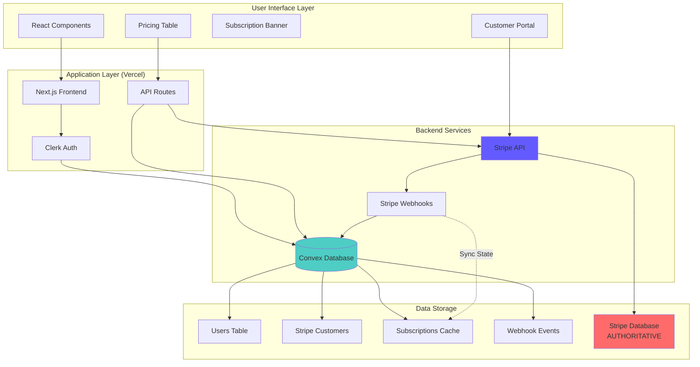

---

## 🎭 Actor Responsibilities

### 1. **Next.js Frontend (Vercel)**
- **Owns**: User interface, client-side state, navigation
- **Responsibilities**: 
  - Render subscription UI components
  - Handle user interactions (upgrade, cancel)
  - Display subscription status and usage limits
  - Route users to Stripe Checkout

### 2. **Next.js API Routes (Vercel)**
- **Owns**: Server-side logic, authentication validation
- **Responsibilities**:
  - Validate Clerk authentication
  - Create Stripe checkout sessions
  - Generate customer portal links
  - Process webhook events

### 3. **Convex Database**
- **Owns**: Application state cache, user data, relationships
- **Responsibilities**:
  - Store user profiles and preferences
  - Cache essential subscription state for performance
  - Track usage and limits
  - Log webhook events for reliability

### 4. **Stripe**
- **Owns**: ALL payment data, subscription state, billing logic
- **Responsibilities**:
  - Process payments and handle failures
  - Manage subscription lifecycles
  - Calculate taxes and handle compliance
  - Send webhook events for state changes
  - **SINGLE SOURCE OF TRUTH** for all billing data

---

## 💾 Data Ownership Matrix

| Data Type | Owner | Storage Location | Sync Pattern | Purpose |
|-----------|-------|------------------|--------------|---------|
| **Payment Methods** | Stripe | Stripe Database | N/A | PCI compliance |
| **Subscription Status** | Stripe | Stripe Database | Webhook → Convex | Real-time UI updates |
| **Product Catalog** | Stripe | Stripe Database | Static config | Pricing display |
| **Customer Billing Data** | Stripe | Stripe Database | Webhook → Convex | Invoice generation |
| **User Profiles** | Convex | Convex Database | API → Stripe metadata | Account management |
| **Usage Tracking** | Convex | Convex Database | Real-time updates | Quota enforcement |
| **Subscription Cache** | Convex | Convex Database | Webhook sync | Performance optimization |
| **Webhook Events** | Convex | Convex Database | Immediate logging | Reliability & debugging |

### 🔐 Data Access Patterns

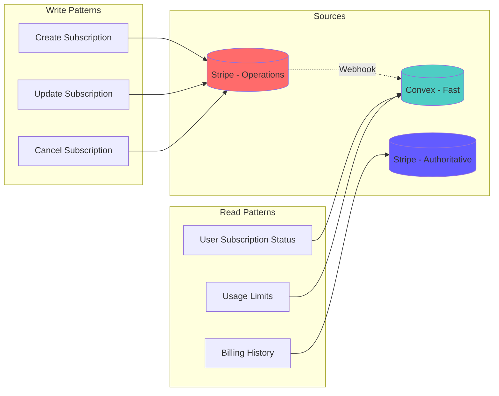

---

## 🔄 Core Workflow Sequences

### 1. New User Subscription Flow

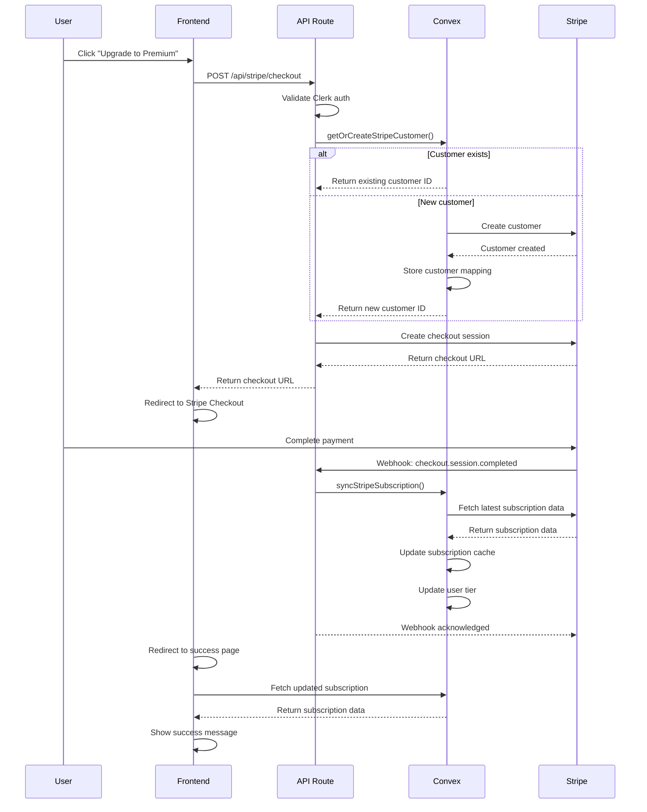

### 2. Subscription Status Check Flow

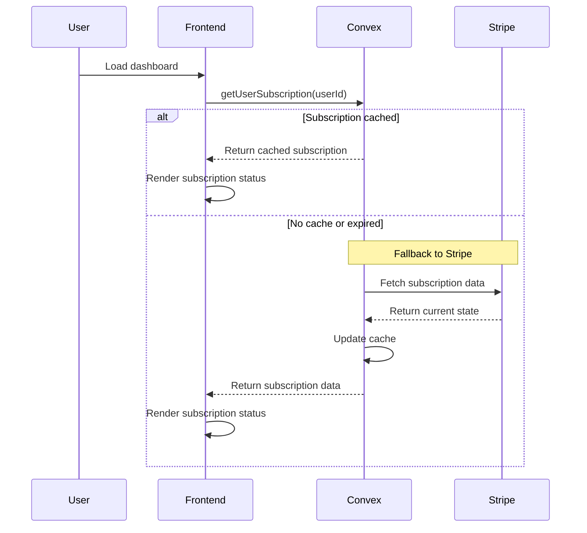

### 3. Webhook Processing Flow

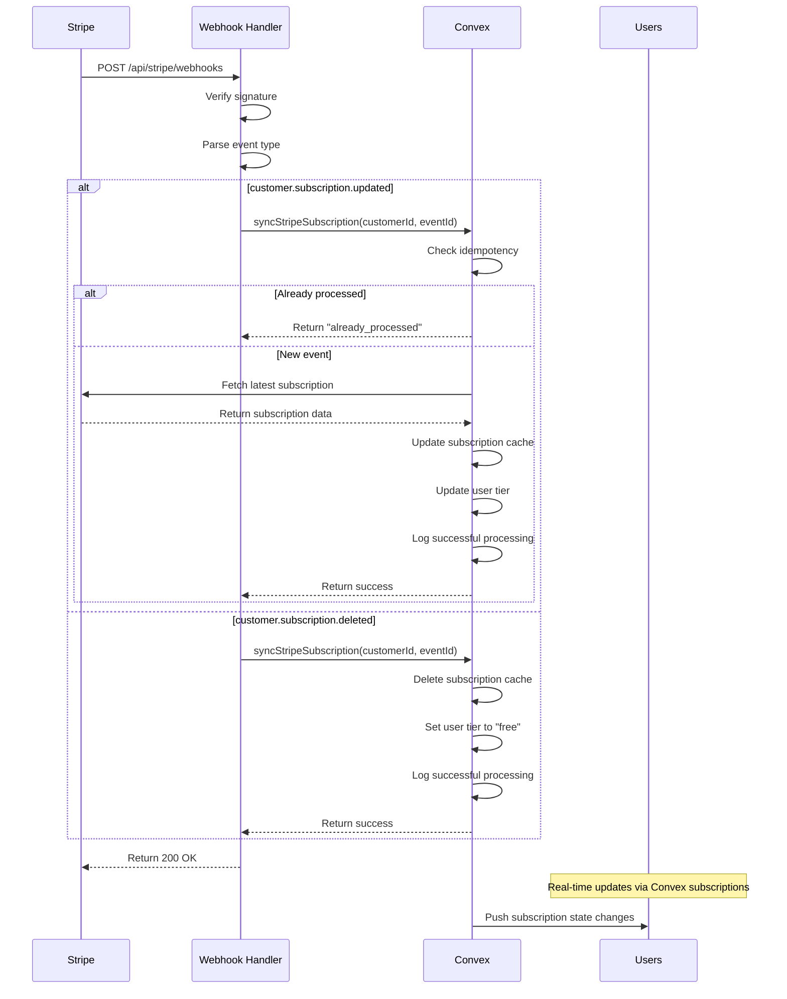

### 4. Customer Portal Access Flow

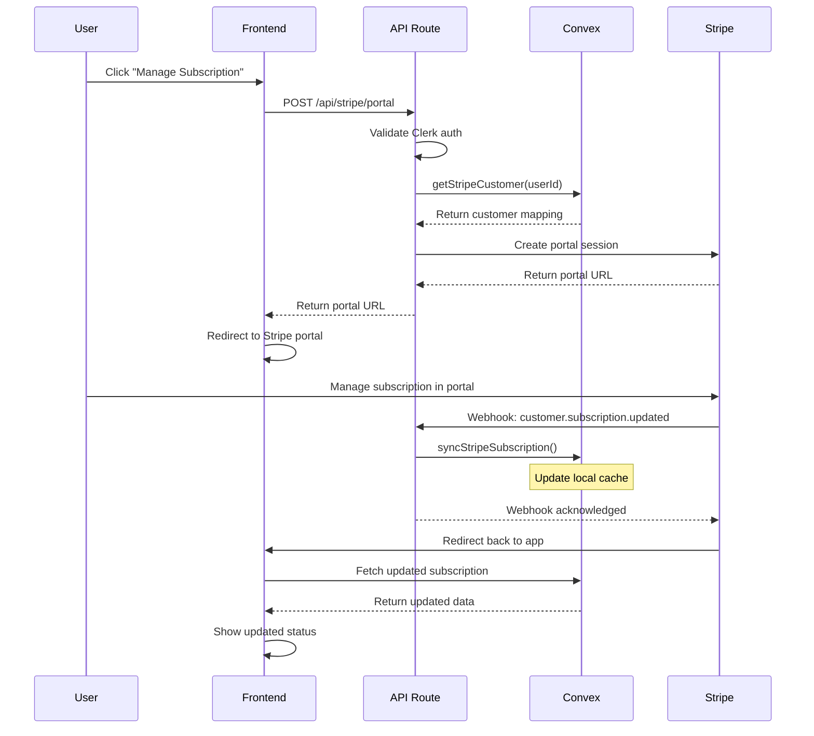

---

## 🔄 Data Synchronization Strategy

### Single Source of Truth Pattern

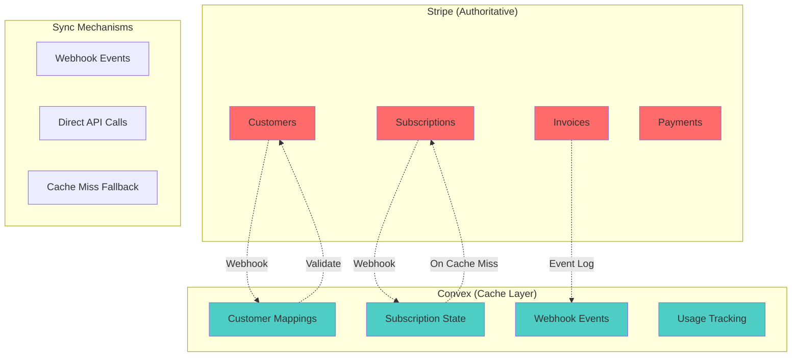

### ACID Compliance Measures

1. **Atomicity**: Each webhook event is processed atomically with idempotency checks
2. **Consistency**: Stripe remains authoritative; Convex cache is eventually consistent
3. **Isolation**: Webhook processing uses database transactions
4. **Durability**: All events are logged for replay and debugging

---

## 🌐 Environment & Configuration Data

### Environment Variables Flow

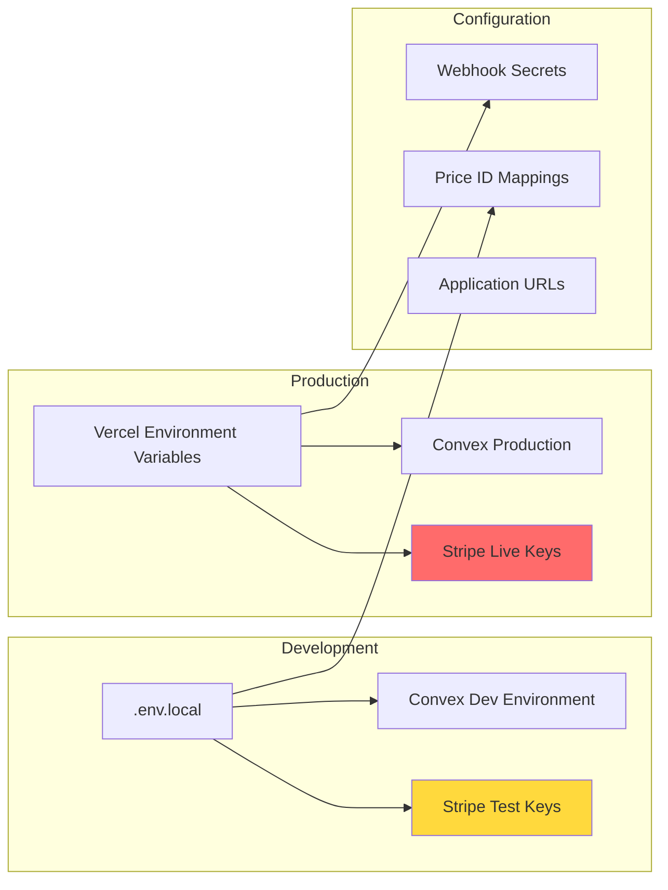

---

## 📊 Quota & Usage Integration

### Usage Limit Enforcement Flow

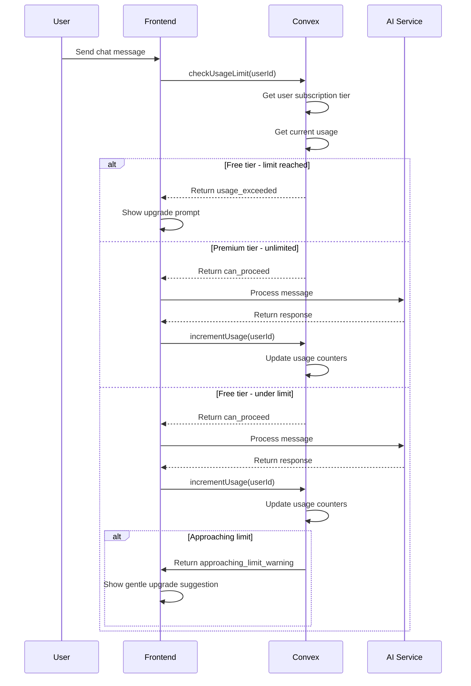

---

## 🚨 Error Handling & Recovery

### Webhook Failure Recovery

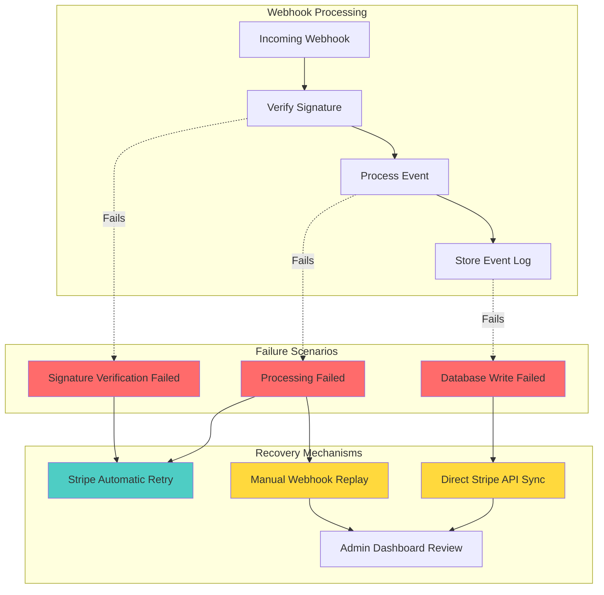

---

## 🔍 Monitoring & Observability

### Key Metrics Dashboard

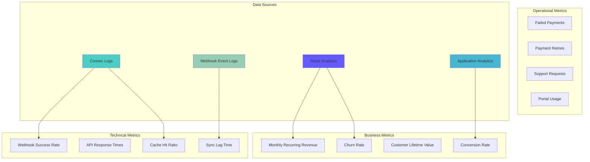

---

## 🎯 Integration Patterns Summary

### Best Practices Implemented

1. **Single Source of Truth**: Stripe owns all billing data
2. **Event-Driven Architecture**: Webhooks drive state synchronization
3. **Idempotent Processing**: Prevent duplicate webhook processing
4. **Graceful Degradation**: Cache misses fall back to Stripe API
5. **Minimal Data Storage**: Only cache essential data for performance
6. **Strong Typing**: TypeScript ensures type safety across all layers
7. **Error Boundaries**: Comprehensive error handling and recovery
8. **Real-time Updates**: Convex subscriptions push updates to UI

### Security Considerations

- **PCI Compliance**: No payment data stored in Convex
- **Webhook Security**: Signature verification on all webhook events
- **Authentication**: Clerk integration for user authentication
- **Authorization**: User-scoped access to subscription data
- **Audit Trail**: Complete webhook event logging

### Performance Optimizations

- **Subscription Caching**: Fast reads from Convex cache
- **Indexed Queries**: Optimized database indexes for common queries
- **Batch Processing**: Efficient webhook event processing
- **CDN Delivery**: Static assets served via Vercel Edge Network

This architecture ensures a robust, scalable, and maintainable Stripe integration that follows industry best practices while maintaining strong type safety and reliability for your T3 chat application.